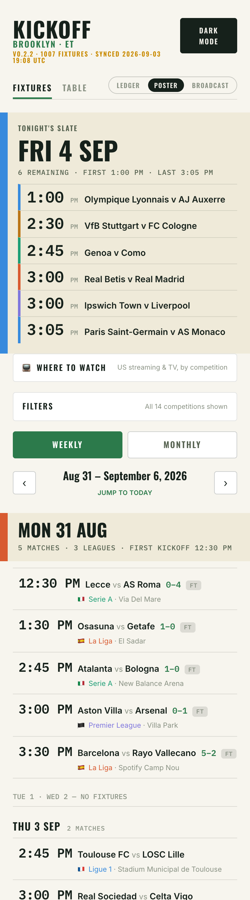
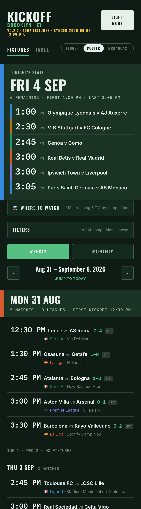

# ⚽ Kickoff

[](https://github.com/BeniCheni/kickoff/actions/workflows/ci.yml)
[](CHANGELOG.md)
[](LICENSE)
[](CLAUDE.md)

**Big-5 European football fixtures and standings, in Brooklyn time — from a tracker that
would rather admit what it doesn't know than tell you a confident lie.**

**Live demo: [benicheni.github.io/kickoff](https://benicheni.github.io/kickoff/)** — a
point-in-time build, redeployed on every merge to `main`. If the amber banner is up when you
get there, that's the app doing its job: the snapshot is older than a day and it says so.

<p align="center">
  
  &nbsp;&nbsp;
  
</p>

## The confession

Fine, LinkedIn, you dragged it out of me: this repo exists because **Claude and I bet on
European football.** Claude has been an exemplary partner in crime — reads the lines,
remembers La Liga's head-to-head tie-breakers, never orders anything at the bar, splits the
winnings zero ways. (The sample size is a coin flip and the variance is undefeated. Let's not
ruin a good story with statistics.)

Here's the part that's true enough to build software on: **the bets were never threatened by
bad picks. They were threatened by bad data.** For a while the operation ran on a hand-typed
HTML dashboard, lovingly maintained, quietly wrong. Then we audited it (23 Aug 2026) and the
rap sheet came back with about twenty falsified rows:

- an entire Ligue 1 opening matchday sitting **one day early**
- a Bundesliga opener **six hours off**
- one fixture that **did not exist** — never scheduled by anyone, ever
- PSG–Rennes with **the wrong team at home** after the LFP relocated it — which, if you're
  keeping score, *inverts the moneyline*

None of those were rendering bugs. They were provenance bugs, and no model, however charming a
co-conspirator, can out-reason a fixture list that lies to it. So the partner in crime built
the fix, and the house rule got carved over the door:

### Never a confident lie.

## What it does (v0.2.3)

La Liga, the Premier League, Serie A, Ligue 1, the Bundesliga, their domestic super cups and
the UEFA Super Cup; full league tables; one fixture skeleton read through three lenses.

Every kickoff traces to one stored UTC instant, so the stadium clock and the Brooklyn clock
can't disagree. Every unset time is admitted out loud instead of guessed. Every sync is
diffed against the last one, so a moved kickoff or a swapped home side surfaces instead of
rotting. The app knows how old its own data is, and says so in amber, then red.

The full argument — the UTC instant, the diff engine, the fail-loud guards, staleness as a
state — is in **[docs/HONESTY.md](docs/HONESTY.md)**. The one-line version: fixture data is
**generated and diffed, never typed.**

## Three lenses, one skeleton

The fixture list is one instrument; a **lens** is the volume knob, not a different product.
A lens may change the atmosphere, the day-header scale, the row density and the hero at the
top of Fixtures. Everything else — tabs, filters, the two-clock rendering, provenance and
staleness callouts, the Table — is the same in all three.

| Lens | The mood | Signature moves |
|------|----------|-----------------|
| **Poster** *(default)* | The editorial desk | Loudness confined to day headers and a full-bleed "tonight's slate" hero, railed in the day's dominant competition colour |
| **Ledger** | The accountant | A date-spine calendar in the Table's quiet language: hairline rows, tap-to-expand, a four-card "Next up" strip |
| **Broadcast** | The stadium screen | Dark-first, floodlight amber as the lead accent, a marquee ticker of live / next / FT, and a glow on exactly the rows that deserve it |

Both themes exist in every lens. Lens, tab, view, date and filters all live in the URL —
`?lens=broadcast&tab=table` means what it says — so any view survives a reload and can be
sent to someone.

## Try it

The [demo](https://benicheni.github.io/kickoff/) needs nothing. To run it yourself:

```bash
npm install
npm run dev      # localhost:5173, hot reload
npm test         # vitest — DST boundaries, the normalizer, the diff engine, the honesty guards
```

The fixture snapshot is committed, so the app works offline from a clone. `npm run sync`
refreshes it from ESPN's public scoreboard API — no key, no account — and prints what moved.
Every command, and what each one is for, is in [CONTRIBUTING.md](CONTRIBUTING.md).

## How it works, briefly

ESPN → normalize → validate at the boundary → snapshot → diff against the last snapshot →
commit → pull request → app. The pure layer (everything under `src/lib/` and `scripts/`) is
unit-tested; the components render what it decides and decide nothing about time themselves.
A scheduled workflow runs the sync every three hours *as scheduled* (GitHub's cron is a
suggestion, not a promise), opens one rolling pull request with the diff, and since v0.2.2
lets that PR merge itself when nothing in it needs a human first — no known fixture moved
inside 72 hours, nothing vanished, nothing inverted. Anything that does is held for a person.

The map, the data flow, where the pure layer ends and the components begin, and the two ESPN
traps worth knowing about are in **[docs/ARCHITECTURE.md](docs/ARCHITECTURE.md)**.

## Contribute

If you love the game and you've ever been burned by a fixture list, you'll like it here.
Three honest places to start, none of them claimed by a scoped release:

- **Back-button honesty.** All date paging replaces history, so Back after five weeks of
  paging exits the site; the active tab pushes a duplicate entry. Row 9 in
  [docs/v0.3.0-ideas.md](docs/v0.3.0-ideas.md).
- **A second data provider.** Cross-check ESPN and *surface* disagreement rather than
  averaging it — the durable fix for wrong venue strings and the one feature that would make
  "never a confident lie" a two-source claim.
- **A venue-correction path.** Two of Rayo Vallecano's twelve home fixtures in the snapshot
  are tagged with Leganés's ground. Venue is cosmetic here and is not hand-corrected —
  hand-correcting generated data is the habit this project exists to break. Design a path
  that isn't that.

Found a fixture the app gets wrong? That's this repo's signature issue type; there's a
[template](.github/ISSUE_TEMPLATE/wrong-fixture-data.md) that asks for the three things we
need. How the repo is built, what a good PR looks like, and why the commits are authored by
Claude: [CONTRIBUTING.md](CONTRIBUTING.md).

## Roadmap

The ranked candidate list is [docs/v0.3.0-ideas.md](docs/v0.3.0-ideas.md); the release plan
that turns it into patches and the v0.3.0 minor is in
[docs/v0.2.1-proposal.md](docs/v0.2.1-proposal.md), amended by
[docs/v0.2.2-proposal.md](docs/v0.2.2-proposal.md). Next up:

- **v0.2.4 — a component test rig** (jsdom beside the node suite), so the clock's component
  wiring, keyboard behaviour and URL hooks get the coverage the pure layer already has.
- **v0.2.5 — the resilience patch:** an error boundary so no malformed input is ever a white
  screen, and the URL contract made total.
- **A design cycle** for the stale LIVE pill — a designed state for "kicked off, outcome
  unknown to this snapshot" — and the palette's AA debts.
- **v0.3.0 — the sync tells the whole truth:** result corrections and team renames in the
  diff engine, then a quiet run that keeps the staleness banner honest through a break.

**Beyond**: betting overlays that join a positions file on fixture ids (the
token-expiry-vs-kickoff map is the obvious first feature); a Results tab — the tab row already
leaves it room.

## Lineage

- **v0.0.1** *(23 Aug 2026)* — the rewrite: generated-and-diffed data replaces the hand-typed
  dashboard.
- **v0.0.2** *(26 Aug 2026)* — the Table: full standings synced from ESPN.
- **v0.1.0** *(31 Aug 2026)* — the lens system: Ledger, Poster, Broadcast over one skeleton;
  hardened by an adversarial review.
- **v0.1.1** *(1 Sep 2026)* — the public-repo milestone: security sweep, license, CI.
- **v0.2.0** *(2 Sep 2026)* — the app learns to tell time: a clock that ticks, a sync that
  fails loudly, a scheduled refresh that opens its own PR.
- **v0.2.1** *(3 Sep 2026)* — the review becomes a command: `/beni-pr-review` as a repo skill.
- **v0.2.2** *(4 Sep 2026)* — the front door: Poster by default, a hero that tells the time, a
  sync that merges its own boring news, an address, and these docs.
- **v0.2.3** *(4 Sep 2026)* — a hotfix: the workflows on Node 24 actions, so no run warns that
  Node 20 is deprecated. The train slides again — the rig is v0.2.4, the resilience patch v0.2.5.

The paper trail for every release — proposals, design briefs, build specs and review
prompts — is indexed in [docs/README.md](docs/README.md). The design system it's built
against (*Fergie Time* — yes, really) is still in the tunnel, unreleased until it earns its
debut.

## License and the small print

[MIT](LICENSE). Not betting advice — the only edge this repo guarantees is a correct kickoff
time, and honestly, that's the one your model can't live without. If you do bet: be of legal
age, in a legal market, with money you can afford to lose. The variance is undefeated.
