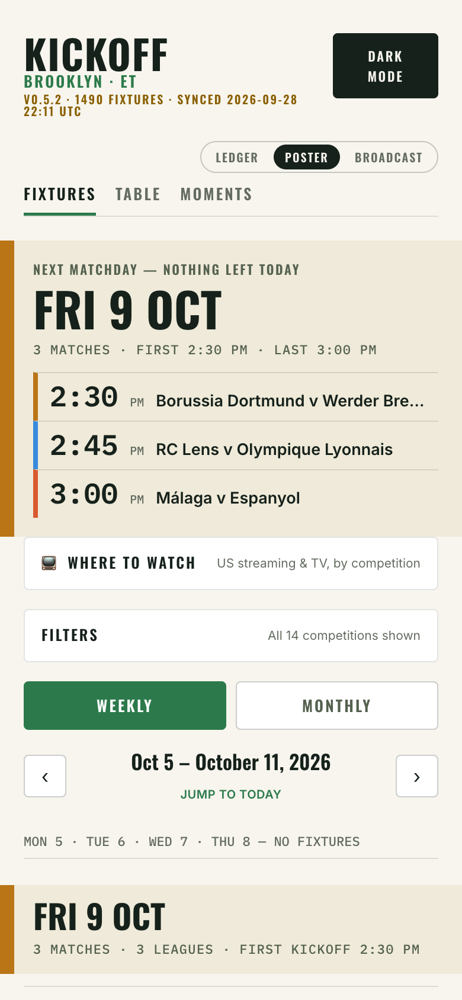
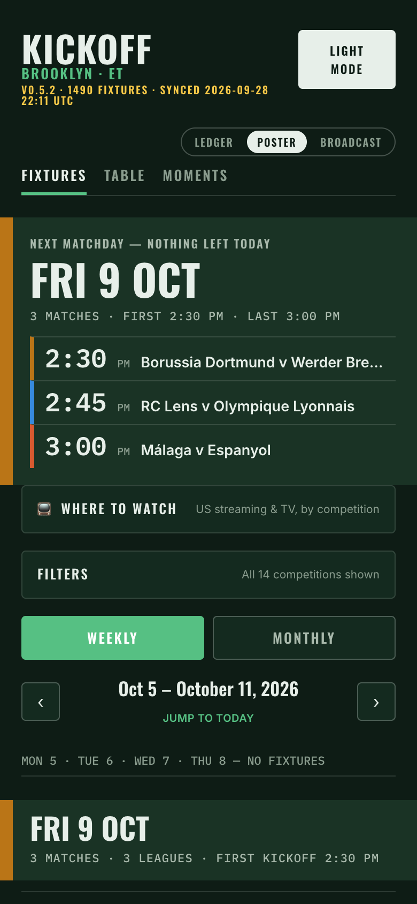
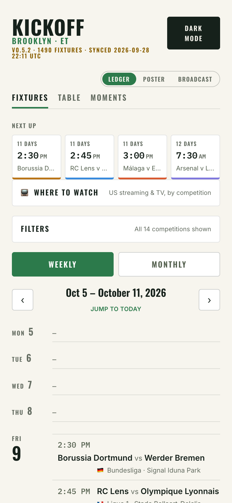
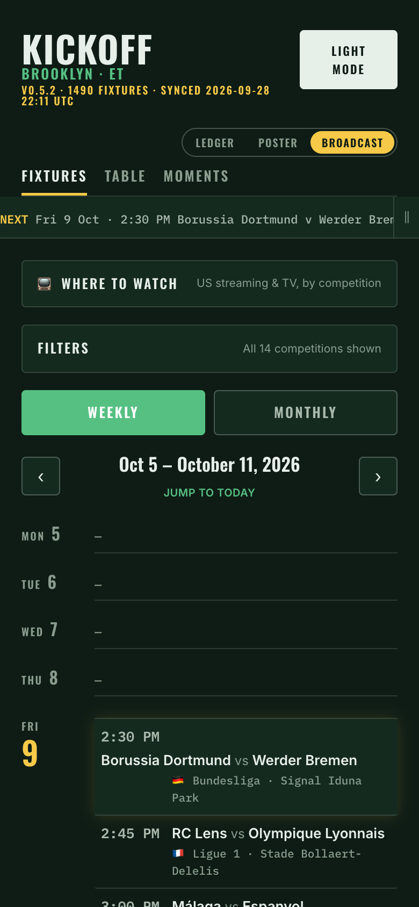
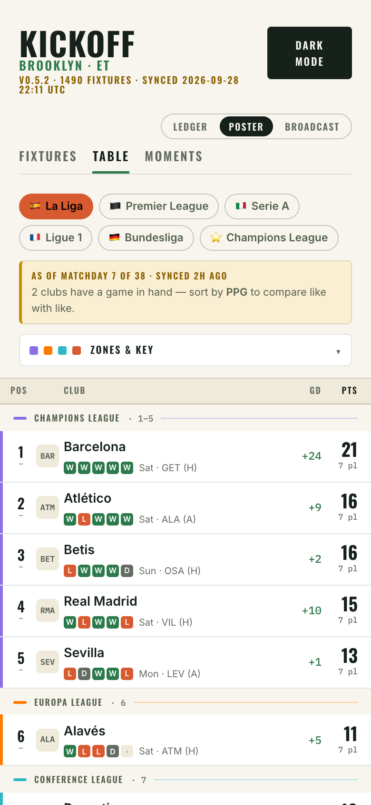
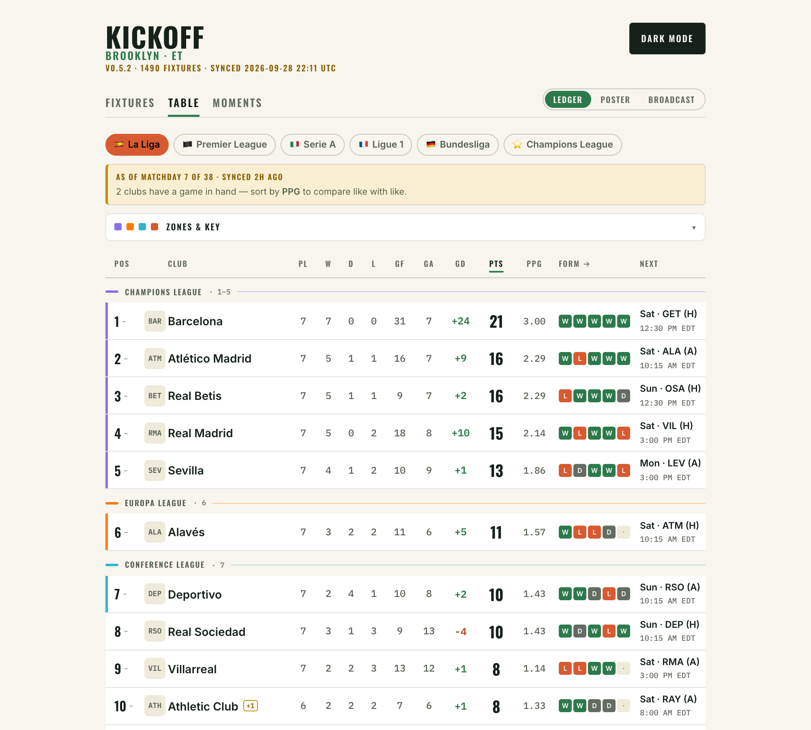

# ⚽ Kickoff

[](https://github.com/BeniCheni/kickoff/actions/workflows/ci.yml)
[](CHANGELOG.md)
[](LICENSE)
[](CLAUDE.md)
[](https://openai.com/codex/)
[](docs/moments-player-plan-review.md)

```
╔════════════════════════════╗
║ ╦╔═ ╦ ╔═╗ ╦╔═ ╔═╗ ╔═╗ ╔═╗  ║
║ ║║  ║ ║   ║║  ║ ║ ║   ║    ║
║ ╠╩╗ ║ ║   ╠╩╗ ║ ║ ╠╣  ╠╣   ║
║ ║ ║ ║ ║   ║ ║ ║ ║ ║   ║    ║
║ ╩ ╩ ╩ ╚═╝ ╩ ╩ ╚═╝ ╩   ╩    ║
╠════════════════════════════╣
║ NEVER A CONFIDENT LIE      ║
╚════════════════════════════╝
```

**A football fixtures tracker that would rather admit what it doesn't know than tell you a
confident lie — and an open notebook on how one person ships software with three AI vendors
building, reviewing and rebutting each other's work.**

You don't need to follow football to read this repo. The football is the excuse. The
interesting part is the workflow: every line of the app was written by an AI coding agent,
every pull request is cold-reviewed by a *different* vendor's agent, the builder gets to argue
back in writing, and a human rules on whatever is still contested. The paper trail for all of
it is in this repo, PR by PR.

**Live demo: [benicheni.github.io/kickoff](https://benicheni.github.io/kickoff/)** — redeployed
on every merge. If the amber banner is up when you get there, that's not a bug; that's the
whole pitch. The data is older than a day and the app would rather say so.

<p align="center">
  
  &nbsp;&nbsp;
  
</p>

## 🎲 Why this exists

This repo exists because **Claude and I bet on European football.** (Small stakes, a coin flip
of a sample size, the variance undefeated. Let's not ruin a good story with statistics.)

The bets were never threatened by bad picks. They were threatened by bad data. The operation
ran on a hand-typed HTML dashboard, lovingly maintained and quietly wrong. When we audited it
on 23 August 2026, about twenty rows were false:

```
┌────────────────────────────┐
│ AUDIT SLIP · 23 AUG 2026   │
│ DASHBOARD v. THE LEAGUES   │
├────────────────────────────┤
│ Ligue 1's opening matchday │
│ ............ ONE DAY EARLY │
│ Bundesliga, the opener     │
│ ............ SIX HOURS OFF │
│ A fixture nobody scheduled │
│ ............ DID NOT EXIST │
│ PSG–Rennes, relocated      │
│ ....... WRONG TEAM AT HOME │
├────────────────────────────┤
│ FALSIFIED ROWS .. ABOUT 20 │
│ SLIP ................ VOID │
└────────────────────────────┘
```

The PSG–Rennes line is the one to sit with. The league moved the match to the other team's
stadium, the dashboard kept the old home side, and if you had money on the home team, you
were now on the wrong team. None of those were rendering bugs. They were *provenance* bugs,
and no model, however charming, can out-reason a fixture list that lies to it.

So the fix got carved over the door: **fixture data is generated and diffed, never typed.**
Nobody hand-edits a kickoff time in this repo. A script fetches, validates, snapshots and
diffs; a human reads the diff. The rest of the app is built to make that rule unbreakable.

## ⏱️ What it does today (v0.5.2)

Fourteen competitions: the five big domestic leagues (La Liga, the Premier League, Serie A,
Ligue 1, the Bundesliga), the three UEFA club competitions (Champions League, Europa League,
Conference League) and the six super cups. 1,490 fixtures and six league tables, synced from
ESPN's public scoreboard and read through three visual "lenses" over one fixture skeleton.

<p align="center">
  
  &nbsp;
  
  &nbsp;
  
</p>

What the app refuses to do is the feature:

- **Two clocks from one instant.** Every kickoff is stored once, as a UTC instant. The stadium
  clock and the Brooklyn clock are derived from it, so they cannot disagree.
- **Unknowns stay unknown.** A kickoff the league hasn't set reads "not yet set". A stadium
  whose time zone isn't known reads "local time not known". Nothing is guessed to look tidy.
- **Every sync is diffed.** A moved date, a changed kickoff, a swapped home side, a fixture that
  vanished, a corrected score: each is named in the pull request the sync opens, so it
  surfaces instead of rotting.
- **Staleness is a state.** The header says when the data was synced; a banner turns amber at
  a day old and red at three.
- **The table tells you what it can't compare.** "2 clubs have a game in hand — sort by PPG."

<p align="center">
  
</p>

**Moments**, the third tab, is a hand-curated shelf of match footage that links to the rights
holders and never plays anything here. It opens empty on purpose; nothing is published until a
curated edition has sourced fixture facts and clear permission to embed. Its gallery, queue and
saved-list machinery are built and merged but dormant, waiting on the player (see *Where we
are*).

The full argument — the UTC instant, the diff engine, the fail-loud guards, staleness as a
state — is in **[docs/HONESTY.md](docs/HONESTY.md)**.

## 🤖 How it gets built

This is the part I'd read first if I weren't a football person.

**Nobody types the code.** The app has 621 tests across 47 files, a scheduled data sync that
opens and merges its own pull requests, and a design system; every line was written by a
coding agent under a written spec, and every commit is authored under that agent's name so
`git log` never has to guess who did what.

**Every version climbs a ladder of documents**, all archived in [`docs/`](docs/README.md):
a *proposal* (an audit of the repo plus directions), a *design brief* (run against the
design system), a *build spec* (the prompt the coding agent executes) and a *review prompt*.
Each is generated from a fresh read of the repo, never from anyone's recollection of it.

**Every PR gets a cross-vendor review.** A release built by one vendor's agent is reviewed
cold by another vendor's agent, in six passes:

| Pass | Who | What they leave behind |
|---|---|---|
| 0 · Brief | The product-manager seat | The review prompt, with the builder's claims sealed in an appendix marked "verify independently" |
| 1 · Cold review | The vendor that did **not** build it | Findings it reproduced, fix commits, one PR comment |
| 1.5 · Rebuttal brief | The PM seat | Each finding packaged for the builder to accept, contest, or accept-but-contest-the-characterisation |
| 2 · Rebuttal | The builder | Its answers, in code |
| 2.5 · Synthesis | The PM seat | Every number re-run at the tip, an executive brief, and a merge gate |
| 3 · Adjudication | A human | Rules on whatever is still contested, and clicks merge |

Why bother with a rebuttal? Because on the first full run the builder overturned the reviewer
on a live technical claim: the reviewer said a malformed team id "can only miss the join"; the
builder reproduced the opposite, one team borrowing another's standings row, and fixed it.
One reviewer would have merged that. Nine pull requests have now been through the cycle.

**The seats are routed by what a mistake would cost, not by brand:**

| Seat | Who sits in it |
|---|---|
| Product manager / scoping / the prompts | Claude (Cowork, then Claude Code) |
| Builder for deep, ambiguous work | Codex (GPT-6 Astra) |
| Builder for small, well-specified work | Codex's lighter models |
| Cold reviewer | Claude Code (Fable 5.1, extra effort) |
| Designer | Claude Design, against the *Fergie Time* design system |
| Newest seat, on trial | Cursor (Grok 4.7): planned the video player slice, now building it |
| CEO | A human, who rules on every contested point and every release |

**Design gets the same treatment.** The Moments feature went through three rounds of
functional prototypes (R1, R2, R3), each sealed with a checksum manifest, each cold-reviewed
by a different agent than the one that drew it. The R3 review measured 1,080 prototype cells
and found a player column that would have been 353px wide on an iPad, below YouTube's stated
minimum. That finding became a ruling, and the ruling became a line in the build spec.

**Verification is measured, never admired.** A review is not "it looks fine". It's 72 browser
cells compared byte-for-byte against `main` to prove a dormant feature changed nothing
visible; 720 cells of gallery geometry with 16,830 hit-tests; a fix reproduced red against the
commit before it and green after. Screenshots are set to a viewport before capture and checked
for horizontal overflow, because one clipped screenshot once cost a whole review pass proving a
bug that didn't exist.

The repo skills that encode all this: [`/kickoff-pr-review`](.claude/skills/kickoff-pr-review/)
runs the six-pass cycle; [`kickoff-design-studio`](.agents/skills/kickoff-design-studio/) and
[`kickoff-design-review`](.agents/skills/kickoff-design-review/) do the same for design.

## 📍 Where we are

**Shipped**: fixtures, standings, the three lenses, the scheduled sync with its self-merging
PRs and change digest, the Champions League with computed matchday provenance and venue clocks
(v0.5.0), and the Moments foundation: the authored-record contract (slice 1) and the dormant
gallery (slice 2), both merged as non-releases with the live site provably unchanged.

**In flight**: Moments slice 3, the video player and its full-screen "Cinema" view. Cursor/Grok
is building it from [a plan it wrote](docs/moments-player-plan.md) that was
[scored against criteria fixed before the run](docs/moments-player-plan-review.md); the build
spec travels with the PR.

Two constraints make it interesting: exactly one player element that is never re-created on
navigation, and not a single request to YouTube until a reader presses Play.

**Next**: slice 4, an end-to-end acceptance pass, one narrowly authorised real-provider test
(all playback so far is simulated), and a first curated edition that needs an explicit
publication decision. When a reader can use Moments, that's the next minor release; the number
is the human's call.

## 🥅 Try it

The [demo](https://benicheni.github.io/kickoff/) needs nothing. To run it yourself:

```bash
npm install
npm run dev      # localhost:5173, hot reload
npm test         # vitest, two projects — the pure layer under node, the component wiring under jsdom
```

The fixture snapshot is committed, so the app works offline from a clone. `npm run sync`
refreshes it from ESPN's public scoreboard API (no key, no account) and prints what moved,
kind by kind. Every command is in [CONTRIBUTING.md](CONTRIBUTING.md); the data flow and the two
ESPN traps worth knowing about are in [docs/ARCHITECTURE.md](docs/ARCHITECTURE.md).

Lens, tab, week and filters all live in the URL — `?lens=broadcast&tab=table` means what it
says — so any view survives a reload and can be sent to someone.

## 🤝 Contribute

If you've ever been burned by a fixture list, or you want to see how a multi-vendor agent
workflow holds up on a real codebase, you'll like it here. Three honest places to start:

- **A second data provider.** Cross-check ESPN and *surface* disagreement rather than
  averaging it — the one feature that would make "never a confident lie" a two-source claim.
- **A venue-correction path** that isn't hand-editing generated data (the habit this project
  exists to break).
- **Back-button honesty.** Date paging replaces history, so Back after five weeks of paging
  exits the site. Row 9 in [docs/v0.3.0-ideas.md](docs/v0.3.0-ideas.md).

Found a fixture the app gets wrong? That's this repo's signature issue type; there's a
[template](.github/ISSUE_TEMPLATE/wrong-fixture-data.md). The ranked candidate list is
[docs/v0.2.6-ideas.md](docs/v0.2.6-ideas.md).

## 🏆 Lineage

One subject line per release. The honours board:

- **v0.5.2** *(17 Sep 2026)* — hotfix to the hotfix: the 30-day lookback restored so the app keeps its recent results.
- **v0.5.1** *(17 Sep 2026)* — hotfix: ESPN's date-range API broke; the sync switched to day-by-day fetching.
- **v0.5.0** *(12 Sep 2026)* — the Champions League joins the schedule: 144 league-phase fixtures, matchday provenance, venue clocks with honest unknowns, a 36-club table, and Moments as an empty-first third tab.
- **v0.4.1** *(12 Sep 2026)* — the small print tells the truth too: every sync warning and red-run outcome says what actually happened.
- **v0.4.0** *(11 Sep 2026)* — the sync tells the whole truth: corrected scores and team identities reported, quiet checks publish verified freshness.
- **v0.3.2** *(9 Sep 2026)* — the sync's verify step survives a live match.
- **v0.3.1** *(8 Sep 2026)* — the Table tells the time like every other lens; the sync merges itself once `verify` is green.
- **v0.3.0** *(6 Sep 2026)* — snapshot states say what is known; the six-pass review cycle is born.
- **v0.2.5** *(5 Sep 2026)* — the resilience patch: fixtures and standings publish together, failed views recover.
- **v0.2.4** *(5 Sep 2026)* — tests reach the wiring: a jsdom project beside the node suite.
- **v0.2.3** *(4 Sep 2026)* — a hotfix: workflows on Node 24.
- **v0.2.2** *(4 Sep 2026)* — the front door: Poster by default, a hero that tells the time, these docs.
- **v0.2.1** *(3 Sep 2026)* — the review becomes a command.
- **v0.2.0** *(2 Sep 2026)* — the app learns to tell time: a clock that ticks, a sync that fails loudly, a scheduled refresh that opens its own PR.
- **v0.1.1** *(1 Sep 2026)* — the public-repo milestone: security sweep, license, CI.
- **v0.1.0** *(31 Aug 2026)* — the lens system: Ledger, Poster, Broadcast over one skeleton.
- **v0.0.2** *(26 Aug 2026)* — the Table: full standings synced from ESPN.
- **v0.0.1** *(23 Aug 2026)* — the rewrite: generated-and-diffed data replaces the hand-typed dashboard.

Every proposal, design brief, build spec, review prompt and executive brief behind those lines
is indexed in [docs/README.md](docs/README.md). The design system they're built against
(*Fergie Time* — yes, really) is still in the tunnel, unreleased until it earns its debut.

## ⚖️ License and the small print

[MIT](LICENSE). Not betting advice — the only edge this repo guarantees is a correct kickoff
time, and honestly, that's the one your model can't live without. If you do bet: be of legal
age, in a legal market, with money you can afford to lose. The variance is undefeated.
