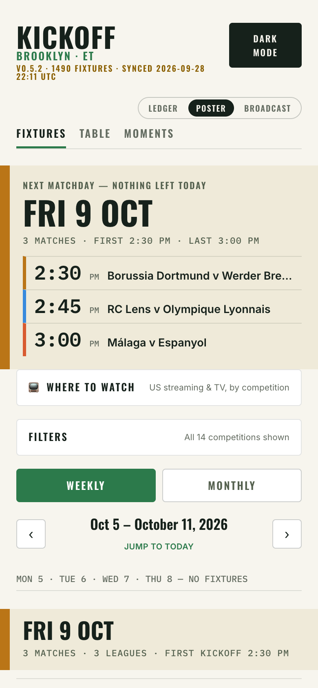
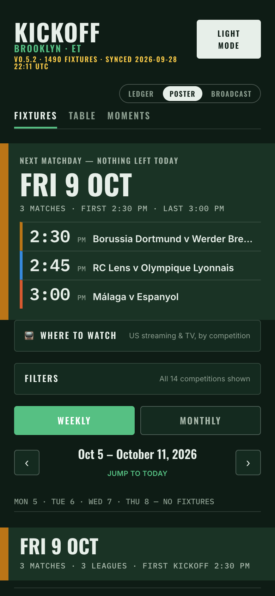
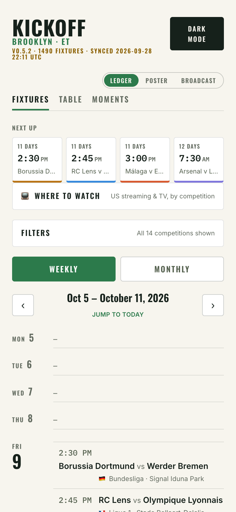
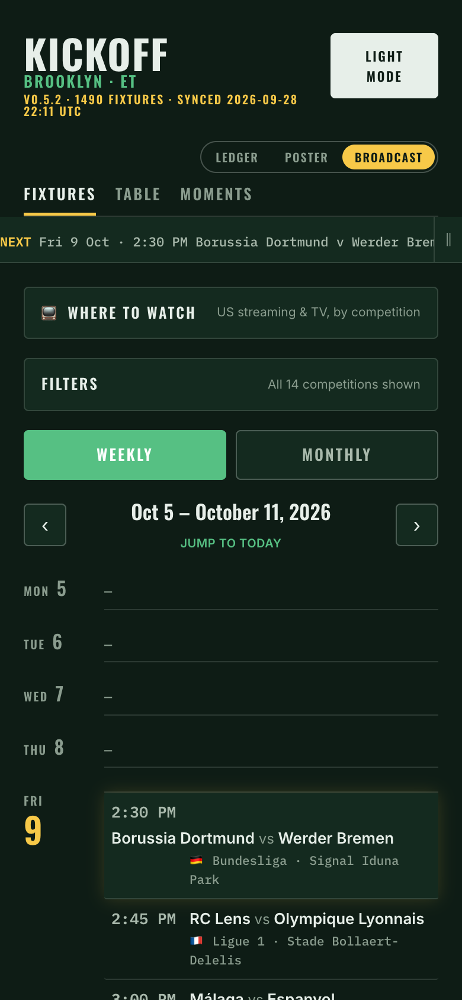
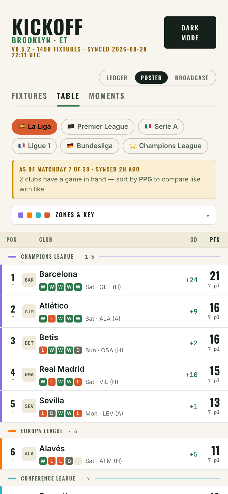
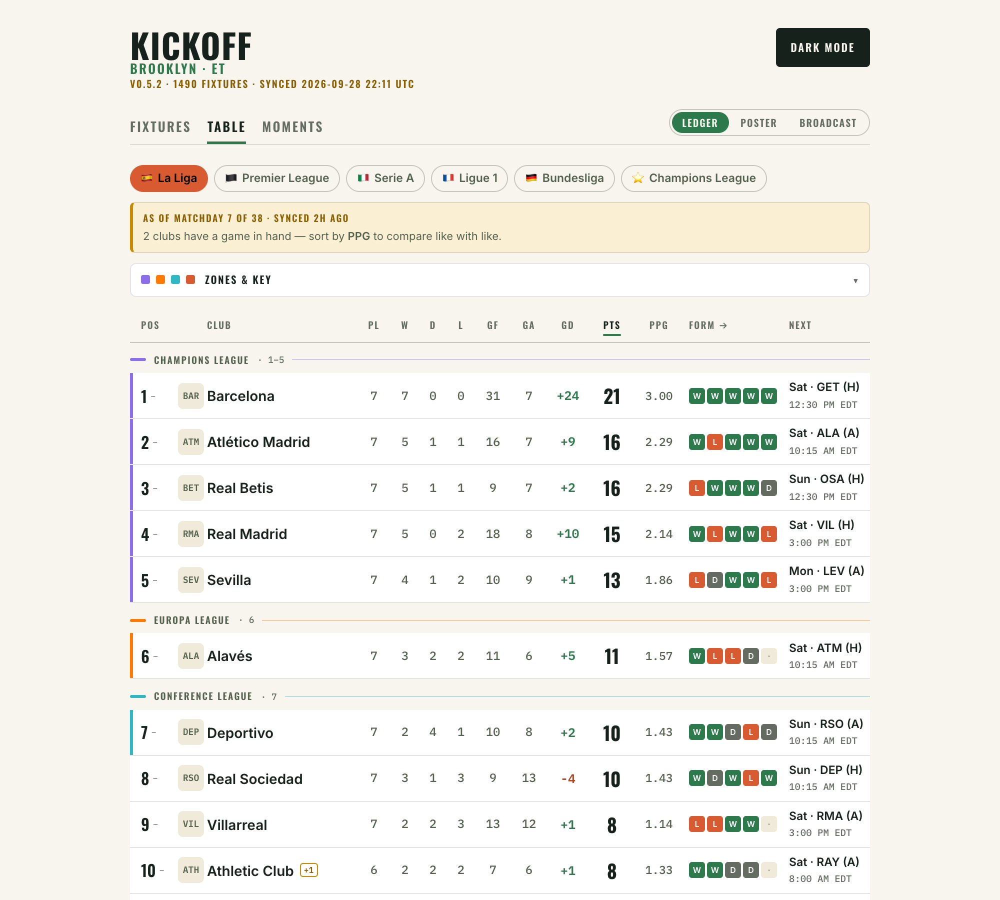

# ⚽ Kickoff

[](https://github.com/BeniCheni/kickoff/actions/workflows/ci.yml)
[](CHANGELOG.md)
[](LICENSE)
[](#-new-kickoff-went-full-stack)
[](CLAUDE.md)
[](https://openai.com/codex/)
[](docs/moments-player-plan-review.md)

```
╔════════════════════════════╗
║ ╦╔═ ╦ ╔═╗ ╦╔═ ╔═╗ ╔═╗ ╔═╗  ║
║ ║║  ║ ║   ║║  ║ ║ ║   ║    ║
║ ╠╩╗ ║ ║   ╠╩╗ ║ ║ ╠╣  ╠╣   ║
║ ║ ║ ║ ║   ║ ║ ║ ║ ║   ║    ║
║ ╩ ╩ ╩ ╚═╝ ╩ ╩ ╚═╝ ╩   ╩    ║
╠════════════════════════════╣
║ NEVER A CONFIDENT LIE      ║
╚════════════════════════════╝
```

**A football fixtures tracker that would rather admit what it doesn't know than tell you a
confident lie. It has just grown a full-stack back end that publishes AI-generated cat
footballers, and it's still an open notebook on how one person ships software with three AI
vendors building, reviewing and rebutting each other's work.**

You don't need to follow football to read this repo. The football is the excuse. The
interesting part is the workflow: every line of the app was written by an AI coding agent,
every pull request is cold-reviewed by a *different* vendor's agent, the builder gets to argue
back in writing, and a human rules on whatever is still contested. The paper trail for all of
it is in this repo, PR by PR.

| If you want | Go here |
|---|---|
| The football app, live | **[benicheni.github.io/kickoff](https://benicheni.github.io/kickoff/)** |
| The full-stack milestone | [New: Kickoff went full-stack](#-new-kickoff-went-full-stack) |
| How three AI vendors build one repo | [How it gets built](#-how-it-gets-built) |
| Why a fixtures app has a motto | [Why this exists](#-why-this-exists) |

> **The straight answer on what's live.** The public demo is the Vite app on GitHub Pages:
> fixtures, standings and three lenses, redeployed on every merge. If the amber banner is up
> when you get there, that's not a bug; that's the whole pitch. The full-stack version
> described below runs today as a private, login-protected preview on Vercel. Its public
> cutover is a numbered plan, not a promise with a date, and `v0.5.2` is still the latest
> release.

<p align="center">
  
  &nbsp;&nbsp;
  
</p>

## 🚀 New: Kickoff went full-stack

The fixtures app is a static site that reads a committed snapshot. The new half is the
opposite: a database, a video store, an admin, and a reader that asks Postgres what to show.
It publishes a gallery of **generated** video (cats playing football, made in Grok Imagine)
under the same rule as the rest of the repo: it says what it is, and it never claims more.

```
 THE STUDIO  (your Mac only)
 import ▸ review ▸ sign-off
        │ Publish
        ▼
 ┌───────────┐ ┌───────────┐
 │ Supabase  │ │Cloudflare │
 │ Postgres  │ │    R2     │
 │+ pgvector │ │  (video)  │
 └─────┬─────┘ └─────┬─────┘
       └──────┬──────┘
              ▼
 THE READER  (Next.js, Vercel)
 read-only role, server-side
```

- **The Studio** (`studio/`) is a local-only admin on `127.0.0.1`. You import a clip, answer a
  five-point checklist (extra players, text on boards, logo-like marks, subject identity,
  soundtrack), and every answer must be `clear` before a clip can be kept. Publishing needs a
  recorded EU AI Act Article 50 answer, and it then writes the catalog row to Supabase and the
  files to Cloudflare R2. Nothing goes live without a human typing the sign-off.
- **Similar moments** come from vectors. At publish time each clip gets CLIP embeddings, from
  its keyframe and from its title and note, stored with pgvector. The model runs on the
  Studio's machine and never in a web request. The reader asks Postgres for a clip's nearest
  neighbours, and the vectors themselves never leave the database.
- **The reader** (`web/`) is a Next.js app that reads published clips through Drizzle on a
  Postgres role that can read the published views and call two similarity functions, and
  nothing else. A published clip shows up on the next page load.
- **Every clip says what it is.** The label is `Generated`, it's never filtered away, and a
  clip is never presented as footage of a real match. The reactions and comments under a video
  are made-up viewers, written by the database, labelled as such, and refused outright on a
  Production deployment.
- **The delivery pipeline** is boring on purpose. `verify` is the one required check, Vercel
  builds only what a change can affect, and after every deployment a smoke test opens the
  protected preview with an automation bypass, checks the deployed commit and the snapshot's
  digest, and scans every response for a leaked secret.

The first clip is *Superhero Kitties*: fifteen seconds, 1920 × 1088, made in Grok Imagine,
published through the Studio, and playing muted from R2 on the preview. The setup, step by
step, is in [`web/README.md`](web/README.md) (the Vercel preview) and
[`studio/README.md`](studio/README.md) (the Studio and its commands).

| Piece | What it is |
|---|---|
| `src/` | The public app: Vite + React 19, static, on GitHub Pages |
| `web/` | The reader: Next.js 16, on Vercel, behind Vercel Authentication |
| `studio/` | The admin and CLI: Node, Drizzle, `@huggingface/transformers`, PGlite for tests |
| `packages/` | `@kickoff/catalog` (the public row contract) and `@kickoff/demo` (the sample layer) |
| Supabase · R2 | Postgres with pgvector for metadata and vectors · Cloudflare R2 for video and thumbnails |

## 🎲 Why this exists

This repo exists because **Claude and I bet on European football.** (Small stakes, a coin flip
of a sample size, the variance undefeated. Let's not ruin a good story with statistics.)

The bets were never threatened by bad picks. They were threatened by bad data. The operation
ran on a hand-typed HTML dashboard, lovingly maintained and quietly wrong. When we audited it
on 23 August 2026, about twenty rows were false:

```
┌────────────────────────────┐
│ AUDIT SLIP · 23 AUG 2026   │
│ DASHBOARD v. THE LEAGUES   │
├────────────────────────────┤
│ Ligue 1's opening matchday │
│ ............ ONE DAY EARLY │
│ Bundesliga, the opener     │
│ ............ SIX HOURS OFF │
│ A fixture nobody scheduled │
│ ............ DID NOT EXIST │
│ PSG–Rennes, relocated      │
│ ....... WRONG TEAM AT HOME │
├────────────────────────────┤
│ FALSIFIED ROWS .. ABOUT 20 │
│ SLIP ................ VOID │
└────────────────────────────┘
```

The PSG–Rennes line is the one to sit with. The league moved the match to the other team's
stadium, the dashboard kept the old home side, and if you had money on the home team, you
were now on the wrong team. None of those were rendering bugs. They were *provenance* bugs,
and no model, however charming, can out-reason a fixture list that lies to it.

So the fix got carved over the door: **fixture data is generated and diffed, never typed.**
Nobody hand-edits a kickoff time in this repo. A script fetches, validates, snapshots and
diffs; a human reads the diff. The rest of the app is built to make that rule unbreakable,
and the full-stack half inherited it: generated video is labelled, and published only by a
person.

## ⏱️ What the football app does today

Fourteen competitions: the five big domestic leagues (La Liga, the Premier League, Serie A,
Ligue 1, the Bundesliga), the three UEFA club competitions (Champions League, Europa League,
Conference League) and the six super cups. 1,440 fixtures and six league tables as of 21
October 2026, synced from ESPN's public scoreboard and read through three visual "lenses"
over one fixture skeleton.

<p align="center">
  
  &nbsp;
  
  &nbsp;
  
</p>

What the app refuses to do is the feature:

- **Two clocks from one instant.** Every kickoff is stored once, as a UTC instant. The stadium
  clock and the Brooklyn clock are derived from it, so they cannot disagree.
- **Unknowns stay unknown.** A kickoff the league hasn't set reads "not yet set". A stadium
  whose time zone isn't known reads "local time not known". Nothing is guessed to look tidy.
- **Every sync is diffed.** A moved date, a changed kickoff, a swapped home side, a fixture that
  vanished, a corrected score: each is named in the pull request the sync opens, so it
  surfaces instead of rotting.
- **Staleness is a state.** The header says when the data was synced; a banner turns amber at
  a day old and red at three.
- **The table tells you what it can't compare.** "2 clubs have a game in hand — sort by PPG."

<p align="center">
  
</p>

The public app also keeps a **Moments** tab. It opens empty on purpose: the full-stack gallery
above lives on the Vercel preview, and the earlier plan to link out to match footage was
dropped on 12 October 2026 in favour of generated-only video. The old player is dormant code,
scheduled for retirement after the cutover.

The full argument — the UTC instant, the diff engine, the fail-loud guards, staleness as a
state — is in **[docs/HONESTY.md](docs/HONESTY.md)**.

## 🤖 How it gets built

This is the part I'd read first if I weren't a football person.

**Nobody types the code.** As of 21 October 2026 the repo carries 1,327 passing tests (965
for the public app, 120 for the reader, 242 for the Studio, one skipped), a scheduled data
sync that opens and merges its own pull requests, and 241 merged PRs, of which the sync opened
a large share itself. Every line was written by a coding agent under a written spec. Branch
commits carry the author who wrote them, and recent squash-merge messages credit every agent
that touched the PR.

**Every version climbs a ladder of documents**, all archived in [`docs/`](docs/README.md):
a *proposal* (an audit of the repo plus directions), a *design brief* (run against the
design system), a *build spec* (the prompt the coding agent executes) and a *review prompt*.
Each is generated from a fresh read of the repo, never from anyone's recollection of it.

**Every PR gets a cross-vendor review.** A release built by one vendor's agent is reviewed
cold by another vendor's agent, in six passes:

| Pass | Who | What they leave behind |
|---|---|---|
| 0 · Brief | The product-manager seat | The review prompt, with the builder's claims sealed in an appendix marked "verify independently" |
| 1 · Cold review | The vendor that did **not** build it | Findings it reproduced, fix commits, one PR comment |
| 1.5 · Rebuttal brief | The PM seat | Each finding packaged for the builder to accept, contest, or accept-but-contest-the-characterisation |
| 2 · Rebuttal | The builder | Its answers, in code |
| 2.5 · Synthesis | A seat that wrote neither the build nor the fixes | Every number re-run at the tip, and a merge gate |
| 3 · Adjudication | A human | Rules on whatever is still contested, and clicks merge |

Why bother with a rebuttal? Because on the first full run the builder overturned the reviewer
on a live technical claim: the reviewer said a malformed team id "can only miss the join"; the
builder reproduced the opposite, one team borrowing another's standings row, and fixed it.
One reviewer would have merged that. The cycle has run on the full-stack work too: the Vercel
pipeline was built by Codex, cold-reviewed twice by Claude Code, and merged on a human's word.

**The seats are routed by what a mistake would cost, not by brand:**

| Seat | Who sits in it |
|---|---|
| Product manager / scoping / the prompts | Claude (Cowork, then Claude Code) |
| Builder | Cursor (Grok 4.7) and Codex (GPT-6 and 6.1), by task shape and by quota |
| Cold reviewer, Pass 1 | Claude Code (Fable 5.1, extra effort) |
| Synthesis and merge, Passes 2.5 to 3 | Codex (GPT-6.1 Sol), on a human's word |
| Designer | Claude Design, against the *Fergie Time* design system |
| CEO | A human, who rules on every contested point and every release |

**Design gets the same treatment.** The Moments gallery went through three rounds of
functional prototypes (R1 to R3) and then the D-series design cycles (D1 to D9), each sealed
with a checksum manifest and each cold-reviewed by a different agent than the one that drew it. One
review measured 1,080 prototype cells and found a player column that would have been 353px
wide on an iPad, below YouTube's stated minimum. That finding became a ruling, and the ruling
became a line in the build spec.

**Verification is measured, never admired.** A review is not "it looks fine". It's 72 browser
cells compared byte-for-byte against `main` to prove a dormant feature changed nothing
visible; 720 cells of gallery geometry with 16,830 hit-tests; a fix reproduced red against the
commit before it and green after. Screenshots are set to a viewport before capture and checked
for horizontal overflow, because one clipped screenshot once cost a whole review pass proving a
bug that didn't exist.

The repo skills that encode all this: [`/kickoff-pr-review`](.claude/skills/kickoff-pr-review/)
runs the six-pass cycle; [`kickoff-design-studio`](.agents/skills/kickoff-design-studio/) and
[`kickoff-design-review`](.agents/skills/kickoff-design-review/) do the same for design.

## 📍 Where we are

**Shipped, and public** (`v0.5.2`): fixtures, standings, the three lenses, the scheduled sync
with its self-merging PRs and change digest, and the Champions League with computed matchday
provenance and venue clocks (v0.5.0).

**Built since, not yet released.** The full-stack work lands as non-releases, because the
public site doesn't change until the cutover:

- **The Studio:** its core and the Supabase schema (#187), Grok Imagine import, the Card gate
  and R2 storage (#226), the local web admin (#227), live import and the engine's gate in
  Publish (#230), and CLIP embeddings with pgvector (#235).
- **The reader:** the Next.js shell, then Fixtures and Table, with the public app's pixels
  compared cell by cell (#198, #203, #206), the shared catalog contract (#212), the Moments
  gallery and watch page (#217), sample reactions and comments (#225), the live read path
  from Supabase (#231) and the Similar moments rail (#237).
- **The pipeline:** a Vercel preview that builds only what changed and smoke-tests itself after
  every deployment (#236).

**Next:** a Shorts feed whose next clip is a random pick among the nearest neighbours, and
a like button whose likes live only in the visitor's browser and shape a "For you" shelf; a
privacy page; then the cutover that makes the Next app the public one, with the Pages address
redirecting. Each step is in [`docs/nextjs-migration-plan.md`](docs/nextjs-migration-plan.md)
and its rulings in [`docs/moments-pivot-record.md`](docs/moments-pivot-record.md).

## 🥅 Try it

The [demo](https://benicheni.github.io/kickoff/) needs nothing. To run it yourself you want
Node 24 (24.15 or later; 22.22.2 or later 22.x, or any 26+, also clears jsdom 30's floor):

```bash
npm install
npm run dev              # localhost:5173, hot reload
npm test                 # vitest, two projects: pure layer under node, component wiring under jsdom
npm run typecheck
npm run build            # static bundle in dist/
npm run sync -- --check  # fetch ESPN, diff against the snapshot, write nothing
```

The fixture snapshot is committed, so the app works offline from a clone. `npm run sync`
refreshes it from ESPN's public scoreboard API (no key, no account) and prints what moved,
kind by kind. It writes to the repo, so read [the commands and the one merge-conflict
recipe](docs/ARCHITECTURE.md#commands) first. The data flow and the two ESPN traps worth
knowing about are in [docs/ARCHITECTURE.md](docs/ARCHITECTURE.md).

The full-stack half needs accounts and keys, so it is a runbook rather than a quick start:
[`web/README.md`](web/README.md) for the reader and its Vercel preview, and
[`studio/README.md`](studio/README.md) for the Studio. Everything in them runs offline against
a local PGlite database until you pass `--live`.

Lens, tab, week and filters all live in the URL — `?lens=broadcast&tab=table` means what it
says — so any view survives a reload and can be sent to someone. Found a fixture the app gets
wrong? That's this repo's signature issue; there's a
[template](.github/ISSUE_TEMPLATE/wrong-fixture-data.md).

## 🏆 Lineage

One subject line per release. The honours board:

- **v0.5.2** *(17 Sep 2026)* — hotfix to the hotfix: the 30-day lookback restored so the app keeps its recent results.
- **v0.5.1** *(17 Sep 2026)* — hotfix: ESPN's date-range API broke; the sync switched to day-by-day fetching.
- **v0.5.0** *(12 Sep 2026)* — the Champions League joins the schedule: 144 league-phase fixtures, matchday provenance, venue clocks with honest unknowns, a 36-club table, and Moments as an empty-first third tab.
- **v0.4.1** *(12 Sep 2026)* — the small print tells the truth too: every sync warning and red-run outcome says what actually happened.
- **v0.4.0** *(11 Sep 2026)* — the sync tells the whole truth: corrected scores and team identities reported, quiet checks publish verified freshness.
- **v0.3.2** *(9 Sep 2026)* — the sync's verify step survives a live match.
- **v0.3.1** *(8 Sep 2026)* — the Table tells the time like every other lens; the sync merges itself once `verify` is green.
- **v0.3.0** *(6 Sep 2026)* — snapshot states say what is known; the six-pass review cycle is born.
- **v0.2.5** *(5 Sep 2026)* — the resilience patch: fixtures and standings publish together, failed views recover.
- **v0.2.4** *(5 Sep 2026)* — tests reach the wiring: a jsdom project beside the node suite.
- **v0.2.3** *(4 Sep 2026)* — a hotfix: workflows on Node 24.
- **v0.2.2** *(4 Sep 2026)* — the front door: Poster by default, a hero that tells the time, these docs.
- **v0.2.1** *(3 Sep 2026)* — the review becomes a command.
- **v0.2.0** *(2 Sep 2026)* — the app learns to tell time: a clock that ticks, a sync that fails loudly, a scheduled refresh that opens its own PR.
- **v0.1.1** *(1 Sep 2026)* — the public-repo milestone: security sweep, license, CI.
- **v0.1.0** *(31 Aug 2026)* — the lens system: Ledger, Poster, Broadcast over one skeleton.
- **v0.0.2** *(26 Aug 2026)* — the Table: full standings synced from ESPN.
- **v0.0.1** *(23 Aug 2026)* — the rewrite: generated-and-diffed data replaces the hand-typed dashboard.

Every proposal, design brief, build spec, review prompt and executive brief behind those lines
is indexed in [docs/README.md](docs/README.md). The design system they're built against
(*Fergie Time* — yes, really) is still in the tunnel, unreleased until it earns its debut.

## ⚖️ License and the small print

[MIT](LICENSE). Not betting advice — the only edge this repo guarantees is a correct kickoff
time, and honestly, that's the one your model can't live without. If you do bet: be of legal
age, in a legal market, with money you can afford to lose. The variance is undefeated.

The generated video is AI-made and labelled as such. The reactions and comments beside it are
made up and labelled as such. The stack choices (Next.js, Drizzle, Supabase, pgvector, CLIP,
Cloudflare, Vercel) follow the shape of ByteByteGo's *Rebuild YouTube with AI* course. Its
reference repo declares no licence, so patterns were studied and no code was copied.
