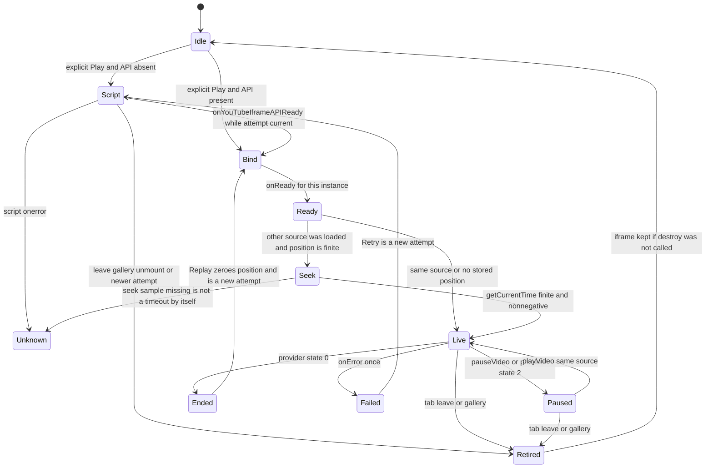

# Moments slice 3 — implementation plan

Plan only. Written against detached `704581c634989cf6cfa98ab471228a3d9467c701` in `/Users/benicheni/kickoff-cursor-plan-slice3`. No repo file was created, edited, or deleted. No branch, commit, push, or PR. Cursor’s build/apply action is not requested. The copy at `/Users/benicheni/kickoff-plans/moments-slice-3-plan-cursor-grok.md` was not written: this session is plan-only and that path is a write.

Who builds this, and when, is Beni’s call after the PM seat scores the plan. Claude Code cold-reviews whatever is built.

## 1. Ground truth

**Commit.** `704581c634989cf6cfa98ab471228a3d9467c701`. `git status` showed `HEAD (no branch)` and one untracked path, `.plan-inputs/`. `git log -1` subject: `docs(moments): record inert and gallery browser evidence`, author Codex. This is the pinned head of PR #118. PR #118 has not been reviewed. This plan does not treat it as approved.

**Seal.** Re-run by this session, not only by the PM seat. `shasum -a 256 -c REVISION.sha256` from `.plan-inputs/docs/design/moments-r3` exited 0 with **56 OK, 0 failed**. Two earlier attempts failed because the shell was still in the repo root; the manifest paths are relative to the package directory. Those failures are cwd mistakes, not a bad seal.

`**src/curated/moments.json**` is `[]`. Read. `src/data/*.json` was not read, on purpose.

**Opened and read in the repo**

- [AGENTS.md](AGENTS.md), [CLAUDE.md](CLAUDE.md) (verification, release management, Fergie Time; already the workspace rules, re-read as the brief requires).
- [docs/moments-architecture.md](docs/moments-architecture.md), all of it, through the slice 2 section ending at the slice 3/4 deferral.
- [docs/moments-gallery-implementation-prompt.md](docs/moments-gallery-implementation-prompt.md): scope, Beni’s 27 Sep rulings, and the slice 2 constraints that name what slice 3 still owns.
- [docs/verification/moments-gallery/README.md](docs/verification/moments-gallery/README.md), all of it.
- [docs/v0.2.6-ideas.md](docs/v0.2.6-ideas.md) rows 56–58 (lines 88–90). Process notes: lines 109–347 and the Moments tail at 549–600. **Lines 348–548 were not read.**
- [src/App.tsx](src/App.tsx), [src/main.tsx](src/main.tsx), [src/components/MomentsSessionProvider.tsx](src/components/MomentsSessionProvider.tsx), [src/components/MomentsPage.tsx](src/components/MomentsPage.tsx), [src/components/ViewBoundary.tsx](src/components/ViewBoundary.tsx), [src/components/MomentCover.tsx](src/components/MomentCover.tsx).
- [src/lib/moments.ts](src/lib/moments.ts), [src/lib/momentsQueue.ts](src/lib/momentsQueue.ts), [src/lib/momentsGallery.ts](src/lib/momentsGallery.ts) (exports only), [src/lib/momentsSaved.ts](src/lib/momentsSaved.ts) (not re-read line by line; used through the provider), [src/lib/momentsReferences.ts](src/lib/momentsReferences.ts) (not opened; row 58’s resolution was read in the architecture and ideas file), [src/lib/lens.ts](src/lib/lens.ts), [src/lib/theme.ts](src/lib/theme.ts), [src/lib/useUrlState.ts](src/lib/useUrlState.ts).
- Moments section of [src/index.css](src/index.css), from the comment at line 199 through the `max-width: 760px` block ending at line 341. CSS above line 180 was not re-read.
- [index.html](index.html), [vite.config.ts](vite.config.ts), [package.json](package.json) scripts and dependencies (`version` is `0.5.2`).
- [tests/dom/rig.ts](tests/dom/rig.ts), [tests/harness/moments.html](tests/harness/moments.html), [tests/harness/moments.tsx](tests/harness/moments.tsx). [tests/dom/momentsGallery.test.tsx](tests/dom/momentsGallery.test.tsx): test titles only, not the bodies. [tests/fixtures/moments/](tests/fixtures/moments/) file names only; fixture bodies not opened. Queue unit tests not opened.

**Design inputs opened**

- `[.plan-inputs/docs/moments-implementation-handoff-2026-09-25.md](.plan-inputs/docs/moments-implementation-handoff-2026-09-25.md)`: decisions, product-contract paragraphs, D-01–D-15 list, and the no-provider-request gate. The opening skill line and seat routing are superseded, as the architecture already says.
- R3: [review.html](.plan-inputs/docs/design/moments-r3/review.html) (all), [decision-brief.md](.plan-inputs/docs/design/moments-r3/decision-brief.md) (rulings, finding dispositions, lens table, media boundaries, status), [evidence-index.md](.plan-inputs/docs/design/moments-r3/evidence-index.md) (all, including the closing “not verified” lines), [index.html](.plan-inputs/docs/design/moments-r3/index.html) (all). [studio.js](.plan-inputs/docs/design/moments-r3/studio.js): the state object, stage/recovery render, open/leaveCinema/gallery, and the click and `keydown` handlers (about lines 9–77). The rest of that file was not read line by line. [studio.css](.plan-inputs/docs/design/moments-r3/studio.css): the shell, player, dialog, cinema max-width, and the 760px / 1250px overrides, via search of the one-line rules. Scripts were not run.
- `[.plan-inputs/docs/design/moments-r3-cold-review.md](.plan-inputs/docs/design/moments-r3-cold-review.md)`: §4 D-16–D-20, §5 table, §6–§12. Appendix A scripts were not read and were not run.

**Provider and platform documents read this session** (28 Sep 2026):

- YouTube IFrame Player API Reference, `https://developers.google.com/youtube/iframe_api_reference` (fetched page, read through the events and the three constructor examples).
- YouTube player parameters, `https://developers.google.com/youtube/player_parameters` (embed methods, parameter table through `widget_referrer`, and the `modestbranding` deprecation note). The revision-history entries after that note were not read one by one.
- YouTube Help, Embed videos & playlists, `https://support.google.com/youtube/answer/171780?hl=en` (privacy-enhanced mode, Referer / error 153, embedding-off steps).
- WHATWG HTML: dialog element (show, showModal, close, previously focused element, inert-on-modal, `closedby`); rendering rule `dialog:not([open]) { display: none; }` extracted from the raw rendering section; close requests §6.10.1 and close-watcher infrastructure §6.10.2. The `CloseWatcher` constructor steps were not read past the interface heading.

## 2. Dependencies on unreviewed PR #118

Slice 3 assumes these slice-2 surfaces stay. If Pass 1 moves one, the host plan moves with it. Do not rebase this plan onto a review that has not happened.

- **Visit owner.** [MomentsSessionProvider](src/components/MomentsSessionProvider.tsx) mounts once, with no key. `useMomentsSession()` is the only queue API the page uses. `dispatch` runs the pure reducer. Tab departure dispatches `leave` once in the effect at lines 49–56. A lens change does not. Save writes stay in the click handler. The lazy initializer has no writes. StrictMode may run it twice; [src/main.tsx](src/main.tsx) and the harness both wrap `App` in `StrictMode`.
- **Where that owner sits today.** [src/App.tsx](src/App.tsx) lines 116–150: `MomentsSessionBoundary` wraps `MomentsSessionProvider`, which wraps the whole `max-w-[780px]` shell, including Fixtures and Table. A session-boundary failure replaces that entire shell with the visit-lost fallback (provider lines 81–90). That is existing slice-2 behaviour. Slice 3 does not widen it.
- **Route boundary.** `MomentsRouteBoundary` (App lines 22–26) is `ViewBoundary` with `key={tab + ':' + lens}`, `allowRetry`, and `onFailure` dispatching `leave`. [ViewBoundary](src/components/ViewBoundary.tsx) reports the failure from `componentDidCatch`. Other tabs keep the older boundary with no `onFailure`. Module-import failures stay outside it, as the boundary’s own comment says.
- **Stage anchor.** [MomentsPage.tsx](src/components/MomentsPage.tsx) line 146: `data-moments-stage-anchor` is an in-flow 16:9 box (CSS lines 295–298) that contains only `MomentCover`. It is rendered only when `queue.surface === 'stage'` (line 126). Empty edition returns the banner and the sentence at lines 215–220 and renders no gallery class.
- **Queue contract slice 3 must call, not rewrite.** `queueNeighbours` (momentsQueue.ts lines 57–62). `surface: 'gallery' | 'stage' | 'cinema'` already exists (line 24) but the UI never dispatches `cinema`. `leave` and `surface: 'gallery'` call `suspend` (lines 76–83, 135–136): playing becomes paused, including at zero, and `attempt` increments. `play` (lines 137–142) is refused on the gallery surface, sets `loading`, increments `attempt`, and zeroes position only when `replay` is set. Provider and failure actions (lines 143–172) drop the wrong item, the wrong attempt, a gallery surface, `ready`/`ended`, and a second terminal failure unless it is an unknown-to-known upgrade. Error `150` is forced to `owner-blocked` (line 149). An unknown failure cannot replace a recorded owner block (lines 155–157). `playing` and `ended` clear the visit failure; `paused` and `position` during loading do not (lines 166–171). Row 56 is already the reducer’s rule. Slice 3 still validates callbacks before dispatch.
- **Harness.** [tests/harness/moments.html](tests/harness/moments.html) is a Vite dev HTML entry. [vite.config.ts](vite.config.ts) sets no custom `build.rollupOptions.input`. Production builds use root [index.html](index.html) only. The harness injects editions and storage failures and renders `App` with `momentsRoute`. Slice 2’s receipt greps both build outputs for harness and fixture markers.

**If Pass 1 moves the owner.** Decision 1 says the provider stays mounted for the App visit, above the keyed route and above the player host, and is not conditional on the Moments tab. If Pass 1 puts the provider inside the `tab === 'moments'` branch, the host would unmount on tab change and the iframe would be destroyed. Slice 3 must not follow that move. If Pass 1 only changes the session-boundary copy, slice 3 is unaffected. If Pass 1 lifts Fixtures and Table out of `MomentsSessionBoundary` so a visit failure no longer removes them, the host stays inside the provider, as a sibling of the keyed route, with its own boundary still between the host and the session boundary. The iframe rules do not change.

## 3. Architecture

The architecture document already decides the owner, the single host, the reducer, and reload-and-seek. This plan follows it. It does not re-decide those.

### Precedence calls

- **888px, not the template’s 760px.** The sealed CSS stacks `.view-layout` only inside `max-width: 760px` and uses a two-column grid otherwise. Beni’s 27 Sep ruling (a), cold-review §12, and the architecture’s slice-2 section (and [src/index.css](src/index.css) lines 320–323) stack through 887px and sit side by side from 888px. The ruling is an amendment after the seal. Slice 3 uses 888 for stage and Cinema. The template’s 760px query is not copied.
- **16:9 box, not the template’s `aspect-ratio: auto` and `min-height`.** Those rules are the D-06 / H-D defect (cold review §6; studio.css sets `aspect-ratio: auto` and `min-height` on `#player`, including `min-height: 480px` from 1250px). The host fills the measured anchor or Cinema slot. No minimum height may defeat the ratio.
- **1440px Cinema content.** Template: `dialog` is `position: fixed; inset: 0; width: 100%; height: 100%`; `.cinema-bar` and `#cinema-home` are `max-width: 1440px; margin: auto`. Slice 3 adopts that full-viewport dialog and 1440px content max. It does not widen the shared 780px header. Parallel to slice 2’s reading of 1160 (CSS lines 199–206: 1120px content plus 20px gutters): Cinema’s 1440 is the template’s content max inside the dialog, not a second app shell.
- **Play is the primary action once an item is selected and has a playback identity.** The template’s primary is the play control. Slice 2’s source link is the inert stand-in (MomentsPage lines 34–53). Slice 3 puts Play in that primary slot. The source link stays, and it still does not set `completed`.
- **Recovery sits under the iframe.** The template paints `.player-message` on top of the simulated box. The slice-3 prompt and Decision 2 require provider controls and attribution to stay unobscured. The overlay is only the pre-intent cover. After the iframe exists, status and recovery are in flow below it.
- **H-G.** The template has two Next controls: `#skip` (“Next selection →”, and it is `class="primary"` in the recovery row) and `#next` in the transport (`index.html` lines 20–23; both call `change(1)` in studio.js). The cold review calls that harmless. The slice-3 prompt says to resolve it. Recommendation for Beni: one Next, the transport button, fed only by `queueNeighbours`. Recovery copy names that same item and does not grow a second button. Retry is the recovery primary; the source link sits beside it. This is decision `single` below. Until Beni says `both`, the plan builds `single`.
- **No history entry** is the template (studio.js `showModal` without `pushState`; cold review P-13). The recommendation matches the template. The option to push history is for Beni in §5, because iOS behaviour was not established.
- **Historical 150 is not the visit’s starting state.** The handoff and the evidence index say the 7–0 block is a recorded observation, not a current prediction, and the architecture says a known block is a recovery entry, not a promise about the next attempt. Provenance keeps showing the authored note, as slice 2 does. `media.status` stays `ready` until an explicit Play. The labelled recovery entry appears when the reducer reaches `blocked`.

### Component tree

```
StrictMode
  App
    MomentsSessionBoundary          (existing; visit-lost fallback)
      MomentsSessionProvider        (existing; unkeyed; whole visit)
        div.max-w-[780px]           (header, tabs, lens switcher)
          tab === moments
            MomentsRouteBoundary    key = tab:lens
              ViewBoundary
                MomentsPage
                  empty edition → banner + sentence, nothing else
                  gallery surface → cards
                  stage surface → heading, data-moments-stage-anchor
                                  (cover only), facts, Play, source link,
                                  neighbours, queue
          other tabs
            ViewBoundary key = tab:lens
              Fixtures or Table
        MomentsPlayerBoundary       (new; sibling of the 780 shell)
          dialog[data-moments-cinema]
            cinema chrome           (hidden unless surface === cinema)
            div[data-moments-cinema-slot]   (in-flow 16:9; laid out in Cinema)
            div[data-moments-player-host]   (stable parent)
              div[data-moments-player-slot] (the node YT.Player may replace)
```

The dialog, host, and iframe stay in this tree for the life of the provider. Nothing in the keyed route renders an iframe. Nothing calls `createPortal`. Nothing moves the host node between stage and Cinema.

Empty edition: `MomentsPlayerBoundary` renders `null`. No dialog, no slot, no script.

### File ownership

- [src/lib/momentsPlayer.ts](src/lib/momentsPlayer.ts) — new. The YouTube adapter and the port both the mock and the harness implement. No React. No new dependency.
- [src/components/MomentsPlayerHost.tsx](src/components/MomentsPlayerHost.tsx) — new. Dialog, host, measurement, Cinema chrome, player boundary. Imports the adapter only from `src/lib/momentsPlayer.ts`.
- [src/App.tsx](src/App.tsx) — mount the boundary as the sibling above. Optional `momentsPlayer` factory argument, defaulting to the real adapter, so tests and the harness can inject the mock. Production `main.tsx` does not pass it.
- [src/components/MomentsSessionProvider.tsx](src/components/MomentsSessionProvider.tsx) — a `play` / `replay` method that dispatches and then, in the same call stack, invokes a handler the host registered. The handler ref lives on the provider. No storage write in an effect.
- [src/components/MomentsPage.tsx](src/components/MomentsPage.tsx) — Play, Replay, Enter Cinema, recovery copy, focus return. Still no iframe.
- [src/index.css](src/index.css) — host, dialog, Cinema 1440, parked state. Ledger remains the base; `poster:` and `broadcast:` only. No new token. No `ledger:` variant (H-A, already how slice 2 is built).
- [tests/momentsPlayer.test.ts](tests/momentsPlayer.test.ts) — new, node project. Real adapter, fake `YT`.
- [tests/dom/momentsPlayer.test.tsx](tests/dom/momentsPlayer.test.tsx) — new. Extends [tests/dom/rig.ts](tests/dom/rig.ts).
- [tests/momentsPlayerMock.ts](tests/momentsPlayerMock.ts) — new, under `tests/` only.
- [tests/harness/moments.tsx](tests/harness/moments.tsx) — pass the mock; add simulation controls here only.
- [docs/moments-architecture.md](docs/moments-architecture.md) — a short “Slice 3 implementation decisions” section, same style as slice 2. No version heading.
- `docs/verification/moments-player/` — new receipt, same role as the gallery receipt. Builder evidence, not approval.

Not touched: `src/curated/moments.json`, `src/data/**`, workflows, URL codecs, Fixtures, Table, `package.json` version, `CHANGELOG.md`.

### Host placement

The IFrame API reference says the constructor replaces the element you pass with an iframe. The stable node is `data-moments-player-host`. The replaceable node is its child slot. After construction the adapter checks `getIframe().parentNode === host`. A mismatch is a failed attempt, one terminal `unknown`, and it does not try a second constructor.

Placement is CSS plus measured boxes. The host element never changes parent.

- **Stage.** `dialog.show()` (non-modal). Cinema chrome is `hidden`. The dialog’s fixed box is set to the anchor’s `getBoundingClientRect()`. The host fills that box. The anchor, and the cover inside it, stay in the keyed page underneath. The dialog must not extend outside that rect, so it cannot cover the queue. D-06 hit-tests prove that.
- **Cinema.** The same open dialog. Do not `close()` and do not `showModal()` (see §5 for why a close/reopen is the wrong way to get a modal). The shell `div.max-w-[780px]` gets `inert`. The dialog grows to the viewport. Chrome is shown. An in-flow slot inside the dialog uses the same stack / 888px two-column grid as `.moments-stage-layout`. The host is `position: absolute` inside the dialog, and its top/left/width/height are the slot’s rect minus the dialog’s rect. The iframe’s parent stays the host.
- **Gallery, or any other tab.** The reducer has already paused and incremented `attempt` (`leave` or `surface: 'gallery'`). The adapter calls `pauseVideo()` and `getCurrentTime()` in that same turn and does not wait. The dialog stays open so the iframe is not put under the UA rule `dialog:not([open]) { display: none }`. A parked class clips the dialog to a fixed 0×0 box at the origin, with `inert`, `aria-hidden="true"`, and `pointer-events: none`. Whether the provider keeps decoding while clipped is **UNVERIFIED**. Slice 4’s stop list includes “the parked instance came back blank.” `destroy()` is not used for parking. `destroy()` runs when the host unmounts (provider unmount, or the player boundary’s fallback).
- **Before the first Play.** The slot exists only after intent. No iframe, no script, no preconnect, no thumbnail. The anchor shows `MomentCover` and the Play button is in the page, in the primary action slot.

**Measurement.** While `surface` is `stage` or `cinema`, remeasure on:

- `ResizeObserver` on the anchor (stage) or the Cinema slot (cinema), and on the gallery main or the dialog, so a reflow above the box is seen even when the box’s own size does not change. A pure move with no size change is why the observer is not the only signal.
- `scroll` on `window` in the capture phase, and `resize` on `window`.
- The next frame after `document.documentElement`’s `data-lens` or `data-theme` changes (`MutationObserver`), and after the queue’s active id or surface changes (`useLayoutEffect`).

`visualViewport` scroll/resize is an extra subscription. The claim that it tracks mobile browser-chrome resize was **not read in a spec this session**; it is inferred. The browser matrix is the proof, not that inference.

The dialog’s box is updated from those reads. No `requestAnimationFrame` loop while idle. Lens styling comes from the existing root `data-lens` / `data-theme` attributes. The host is outside the 780 shell and still under `documentElement`, so it inherits the same tokens. A lens change does not dispatch `leave`.

**Phone height versus the provider minimum.** Calculated from CSS, not measured in a browser this session. Gallery width is `min(100vw - 40px, 1120px)` (index.css line 202). The anchor is `width: 100%; aspect-ratio: 16/9` (line 297). At 360px that box is 320×180. At 390px it is 350×196.875. A 16:9 box is 200px tall only at width 355.56, which needs a viewport of about 396px with the 40px gutters. The provider’s own requirement, read in the API reference and again in the player-parameters page, is a viewport of at least 200×200, with 480×270 recommended for 16:9. Side-by-side already clears 480×270: the CSS comment at line 321, and the slice-2 receipt’s measured 520×292.5 at 888px (receipt read, not remeasured here). On a phone, growing the iframe to 200×200 inside a shorter 16:9 anchor is the D-06 failure mode (a box that leaves its column and covers the queue). Recommendation: clip the host to the anchor and keep 16:9, including where the height is under 200. Decision `clip` below. Slice 4 stops if the real iframe refuses that size and intersects the queue.

### Adapter lifecycle, per attempt

The adapter closure captures `{ itemId, attempt, instanceId }`. `instanceId` changes when `YT.Player` is constructed or `destroy()` runs. A callback is dispatched only when all of these hold: `event.target` is the current player; the captured attempt and item are still current; the player has not been retired; the event’s `data` is one of the documented state integers or error integers; and, for `playing` and `ended`, the loaded video id still matches the attempt. `getVideoUrl()` is consulted when it returns a string. The documented event object has `target` and `data`. It does **not** include a `MessageEvent` origin. Origin is enforced by the `origin` player parameter and by the iframe `src` we build. A raw `message` listener is not added; the API’s own callback is the dispatch path. Claiming we inspect `MessageEvent.origin` on `onStateChange` would invent a field the reference does not list.




- **Cancellation.** `leave`, gallery `surface`, and a newer `play` retire the closure. In-flight script load must not construct if the attempt is already retired. An already built player is paused, not destroyed, so the single instance remains.
- **Stale callbacks.** The retired closure returns before `dispatch`. The reducer would also drop a wrong attempt. Tests assert the adapter does not call `dispatch` the second time.
- **One terminal failure per attempt.** A flag in the closure. A later `onError` on that attempt is ignored. Unknown-to-known upgrade stays the reducer’s job if a second, different, accepted failure is ever dispatched; the adapter’s job is not to send the second one. Codes: `101` and `150` → `owner-blocked` (the reference says 150 is the same as 101); `2`, `5`, and `100` → `unavailable` (row 56); `153` and any other integer → `unknown`, which the reducer stores as `timeout`. `153` is the missing-Referer code from the same `onError` list and from the Help page. It is not an owner block and not a territory claim. No new reducer kind.
- **StrictMode.** Player creation runs from the click handler the provider calls synchronously, not from an effect. StrictMode double-mounts effects and the initial commit; it does not replay the click. The host is outside the keyed boundary, so a lens or tab key does not remount it. The unit test mounts the adapter twice the way StrictMode remounts a component and asserts one player after cleanup of the first strict pass, and that the first instance’s `onError` is ignored.
- **Error boundaries.** A render throw in the host is caught by `MomentsPlayerBoundary`. Fallback copy says the player could not be shown and offers “Retry player”, which remounts only that boundary. `componentWillUnmount` retires and `destroy()`s the instance. It does not dispatch `leave`, so the visit, the route, Fixtures, and Table stay. The session boundary is an ancestor; the player boundary has to actually catch, or the existing visit-lost fallback will remove the shell. A route throw still dispatches `leave` through the existing `onFailure`, which parks and pauses. Async provider errors are reducer failures, not boundary throws. `ViewBoundary` still does not catch event-handler or module-import failures.
- **Tab away and back.** The existing effect dispatches `leave` once. Surface becomes `gallery`, playback pauses, attempt increments, host parks, no autoplay on return. Coming back to Moments shows the gallery (or the resume affordance slice 2 already has). Play is required again. If the same source is still the loaded video, that Play calls `playVideo()` only. If the user had no Play yet, the parked tree was never created.
- **Lens switch during play.** No `leave`. State stays `playing`. Remeasure after `data-lens` / `data-theme`. Tokens follow the root. Copy does not change (decision brief: facts and recovery text are invariant across lenses).
- **Gallery return.** Page dispatches `surface: 'gallery'` and focuses the gallery heading, which slice 2 already does (MomentsPage lines 127–137). Suspend pauses even at position zero. Host parks. Reopening the item restores `stage` without autoplay. Cinema entry and exit dispatch `surface` to `cinema` or `stage` and do not suspend (reducer line 136: only gallery suspends).
- **Position.** On pause, on `ended`, and just before retire, read `getCurrentTime()`. Dispatch `position` only when the value is a finite number and `>= 0`, including zero. Otherwise dispatch nothing and let the reducer keep its last value. Do not add elapsed wall time. Do not read `getDuration()` to invent a fraction. The reference describes `getCurrentTime` as a returned number, not a promise. If a real player blocks, slice 4 records it; the call is still not awaited before navigation.
- **Reload-and-seek.** When this instance’s loaded video id differs from the requested id, explicit Play calls `loadVideoById` **without** `startSeconds` (that argument seeks to the nearest keyframe and the reference does not give a success event). On `onReady` or cued (`5`), call `seekTo(position, true)`, then read `getCurrentTime()`. Show “Resuming from the last known position” only after that sample is finite and nonnegative. The label uses the sample, not the requested target. If the user navigates before a sample, do not show the label and do not wait. Same-source `playVideo()` does not show the label. Replay after `ended` zeros position in the reducer and loads again; it is not a resume.

**User activation.** `loadVideoById` and `playVideo` are in the `onAutoplayBlocked` list. The Play click calls the adapter in the same turn. If the script is still downloading, `playVideo` runs later, in `onReady`, and the browser may block it. On `onAutoplayBlocked`, stay on `loading`, do not dispatch `failure`, and leave the provider’s own control usable (`controls` stays at its default `1`; do not set `controls=0`). Copy under the player: playback has not started, and the control inside the player can start it. That copy is neutral. It is not the timeout sentence and not the owner-block sentence.

**No wall-clock watchdog.** The reference does not define a timeout duration. Slice 3 does not invent one. `unknown` / `timeout` is a script `onerror`, a constructor throw, or an unclassified `onError` code. A hung load stays `loading` until the user leaves (attempt retired) or a provider event arrives. Decision `none` below.

## 4. Provider contract

Each item is what the page says, in this session’s words. Anything not on those pages is marked.

- **Script loading.** The IFrame API reference’s getting-started sample inserts a script whose `src` is `https://www.youtube.com/iframe_api` and defines a global `onYouTubeIframeAPIReady`. The API calls that function after the player JavaScript has downloaded. The sample says the download is asynchronous because it is inserted with DOM methods. The player-parameters page shows a **different** sample: `https://www.youtube.com/player_api` and `onYouTubePlayerAPIReady`. Equivalence of those two URLs was **not stated** on either page. Slice 3 follows the IFrame API reference only. One script element, created on the first explicit Play, never from [index.html](index.html). Today’s `index.html` preconnects only to Google Fonts (lines 11–16). Do not add a YouTube preconnect.
- **Player readiness.** `onReady` fires when the player has finished loading and can take API calls. The reference’s own samples then call `playVideo()`. We do that only for the attempt that is still current, and only after an explicit Play. Default `autoplay` is `0` (player parameters). Do not set `autoplay=1`.
- **State changes.** `onStateChange` `data`: `-1` unstarted, `0` ended, `1` playing, `2` paused, `3` buffering, `5` video cued. Named constants exist for ended, playing, paused, buffering, and cued. The first load broadcasts unstarted; a cued video broadcasts `5`. Map `0` → reducer `ended` (the only event that may set `completed`), `1` → `playing`, `2` → `paused`. Do not map `-1`, `3`, or `5` onto `playing`. A position sample during `3` or `5` is allowed only if `getCurrentTime()` is finite and nonnegative; it does not clear a failure record, because the reducer already ignores that for `position` and `paused` during loading.
- **Error codes.** `onError` `data`: `2` invalid parameter; `5` HTML5 player error; `100` not found, removed, or private; `101` owner does not allow embedded playback; `150` “the same as 101”; `153` missing HTTP Referer or equivalent client identification. Mapping is in §3. The Help page says viewers who hit 153 can still use “Watch on YouTube”, and that a bare player URL without an enclosing page typically has no Referer. Our iframe will be inside the app document. Whether that sends a Referer on the deployed site was **not tested**.
- **Current time.** `getCurrentTime()` returns elapsed seconds since the video started playing. The sentence does not say the number is always finite or always ≥ 0. The adapter drops any other value. `getDuration()` returns `0` until metadata has loaded, and for a live event it returns elapsed stream time. Slice 3 does not call it to estimate position.
- **Seeking.** `seekTo(seconds, allowSeekAhead)` seeks to the nearest keyframe at or before the requested time unless that portion is already buffered. If the player is paused, it stays paused; otherwise it plays. `allowSeekAhead: true` is what the reference recommends when the user releases a scrub, because `false` avoids a new request during a drag. We are not dragging; we pass `true` once. There is no documented seek-complete event. “Seek succeeded” in this plan means a later finite nonnegative `getCurrentTime()` sample, not a promise the API does not describe. `loadVideoById`’s `startSeconds` also starts at the nearest keyframe and “loads and plays”. We do not use `startSeconds`, so the play and the observed seek stay separate. `cueVideoById` “loads the specified video’s thumbnail” and does not request the video until `playVideo()` or `seekTo()`. That thumbnail is a provider request. Do not call `cueVideoById` at all.
- **Origin.** For an iframe you write yourself, the reference says to add `origin` as an extra security measure: the scheme (`http://` or `https://`) and the full domain of the host page. It protects against third-party script hijacking the player. The parameter is optional and “you should always specify” it when `enablejsapi=1` (player parameters). The example value is `http://example.com`, with no port. Slice 3 passes `window.location.origin` (scheme, host, and port). Whether a non-default port must be included was **not stated**. Slice 4 on the Vite port and on the preview origin is the check. `enablejsapi=1` is required for API control; the default is `0`.
- **Replacing the node.** The constructor’s first argument is the element or its id. The API replaces that element with the iframe. An iframe is `inline-block` by default, which can change layout if you replace a differently displayed node. We replace only the inner slot, and the host’s CSS box is the measured rect.
- **pause, stop, destroy.** `pauseVideo()` ends in state `2` unless the state was already `0`, in which case it does not change. `stopVideo()` can land in ended, paused, cued, or unstarted, and the reference says to reserve it for when the user will not watch more video. Slice 3 uses `pauseVideo` for gallery and tab leave, not `stopVideo`. `destroy()` removes the iframe. Use it on host unmount only.
- **Size.** Requirements, in both the API reference and the player-parameters page: at least 200×200; if controls are shown, they must fit without shrinking the viewport under that minimum; 16:9 players should be at least 480×270. `setSize(width, height)` sets the iframe size in pixels. We size with CSS to the measured box and also pass that box into the constructor so the API’s width/height are not left at the defaults 640×390. Whether the player then forces a 200px minimum anyway is **UNVERIFIED** (the pages state the requirement; they do not say the iframe overflows its CSS box).
- **Embed host.** The Help page’s privacy-enhanced mode: change the embed URL domain from `https://www.youtube.com` to `https://www.youtube-nocookie.com`. Views in that mode are not used to personalize YouTube browsing or off-site ads; ads in the embed, if any, are non-personalized. The page says this mode is for embedded players on websites, and that a child-directed site must still self-designate. Kickoff is not a child-directed app; that sentence is recorded so it is not silently ignored. The network allowlist note on that page is for administrators, not a code change. **A `host` option on the `YT.Player` constructor was not found** on either developer page. Do not pass an undocumented `host` field. If Beni chooses the nocookie domain, build the iframe element ourselves with that `src` and pass the element to `YT.Player`, which the reference’s “existing iframe” example allows. The API script URL stays `https://www.youtube.com/iframe_api` either way; the Help page does not say the script moves to the nocookie domain.
- **playsinline.** Player parameters: `0` is fullscreen on iOS and is the current default; `1` plays inline in mobile browsers. Recommendation: `1`, so Cinema is not replaced by the system fullscreen player. Decision `inline` below. Not verified on a device.
- **controls and branding.** `controls=1` is the default. Leave it. `modestbranding` is deprecated and has no effect (parameters page, 15 Aug 2023 note). Do not set it. Do not set `controls=0`.
- **What this plan does not claim.** Ads, captions, territory, login walls, age-restricted redirect behaviour beyond the Help page’s one sentence (age-restricted videos cannot be watched on most third-party sites and redirect to YouTube), postMessage origin filtering inside Google’s script, and behaviour of `getCurrentTime` while the iframe is clipped. The Help page’s age-restriction sentence was read; it is not a test result.

## 5. Cinema, dialog, and focus

Cinema is the same `dialog` that already parents the host. The rest of the app is the 780px shell. While `surface === 'cinema'`, that shell is `inert`. The spec says inert nodes are not exposed to accessibility APIs and cannot be focused. The iframe is inside the dialog, so it is not under that inert shell. A `showModal()` dialog would also inert the rest of the document, but only for descendants of the dialog; that is why the host has to be inside the dialog either way.

**Why not `close()` then `showModal()`.** `show()` while already open returns; `showModal()` while already open throws `InvalidStateError`. Switching would `close()` first. Closing removes `open`. The rendering section sets `dialog:not([open]) { display: none }`. The iframe would pass through `display: none` on every stage/Cinema transition. Effect on a live player: **UNVERIFIED**. The plan does not do that transition.

**Focus.**

- On entering Cinema, record the control that opened it (the stage’s Cinema button) and move focus to Exit. The template focuses `#cinema-exit` (studio.js). The spec’s dialog focusing steps and `previously focused element` apply to `show()` / `showModal()`. Because we keep one already-open dialog, we do not rely on the UA to remember the opener. We store it ourselves.
- Exit and Escape set `surface` back to `stage`, remove `inert` from the shell, remeasure the anchor, and focus the stored Cinema button. The stage page is still mounted; we did not unmount it.
- Gallery from Cinema first returns to stage only in the sense of closing the modal, then the existing gallery action runs: `surface: 'gallery'`, park, focus the gallery heading. One path, so focus does not land on a detached node.
- While Cinema is open, Tab wraps among the dialog’s sequential controls. The iframe is one stop. Once focus is inside the cross-origin frame, the parent cannot see it and must not pull it back on a timer. When focus returns to the parent outside the dialog, move it to Exit or to the last control, matching direction. Sentinel buttons at both ends of the dialog implement the wrap the template does by hand (studio.js `keydown` on the dialog, lines 77 area). `closedby` handling is below and must not fight this.
- Provider controls stay in the iframe. Our buttons are outside the host rect. No translucent layer on the iframe. The YouTube title and logo, whatever the player draws, are not covered. **UNVERIFIED** until a real player is on screen.
- D-15: activating a queue row inside Cinema scrolls the dialog until the slot and the primary action (Play, Replay, or Retry) are inside the dialog’s visible box, then focuses that action with `preventScroll: true` so the focus call does not undo the scroll. The row click must not leave focus on a row that sits below the player. Keyboard activation (Enter/Space on the row) uses the same path. jsdom does not prove this; the browser check does. The rig’s `installSelectionScroll` stays for the heading focus tests; it is not a substitute for the browser scroll.
- D-07 / D-19 in the modal: Save’s feedback node is rendered in the Cinema subtree. The stage’s live region is inside the inert shell, so it is not a second speaking region. Exactly one `role="status"` receives the new text. Retry’s own status sits next to Retry and clears when `active` changes, which already clears `notice` on selection in the provider (lines 46–47). Visible Save label remains “Save reference”; state stays `aria-pressed`. No second name flip.
- D-17: Cinema uses the same action row and reserved feedback row slice 2 already built (`.moments-feedback` has `min-height: 33px`). The browser check repeats the ±1px rect test on the Cinema Save control.
- D-18: recovery and status strings do not append a terminal mark to a title. Counts stay numerals. Slice 2’s DOM coverage remains; Cinema strings join it.
- D-20: new Cinema text is at least 10px. The empty-edition banner stays 9.5px under the inert ruling. Do not copy the template’s 8px and 9px phone styles.

**H-C options**

The spec’s close-request section says, in substance: a close request is implementation-defined and device-specific. Examples include Esc on desktop, “the back button or gesture on certain mobile platforms such as Android”, and iOS VoiceOver’s two-finger scrub. If a close watcher handles it, the steps return and do not go on to the fallback. If nothing is watching, the UA may do something else; the Android-style example given is history traversal by −1. A non-modal dialog’s default `closedby` of Auto is the None state, so its close watcher is disabled (`getEnabledState` is false when the computed closed-by state is None). A modal dialog’s Auto state is Close Request, so the watcher is enabled.

iOS Safari’s back button or edge-swipe is **not** in that example list. The cold review says iOS Safari navigates away and marks the device check not done. This plan does not adopt that sentence as a verified fact.

- `**no` (recommended).** No `pushState`. While Cinema is showing, set `closedby="closerequest"` so the dialog’s existing watcher becomes enabled. On `cancel`, if the event is cancelable, `preventDefault`, dispatch `surface: 'stage'`, and leave the dialog open so the iframe never hits `display: none`. Esc is a close request on desktop platforms per the same section; this is the Escape path as well as the Android-style back path. If `preventDefault` is ignored and the dialog actually closes, call `show()` again in that turn, re-park or re-place the same iframe, and do not `destroy()`. The spec’s `canPreventClose` flag is conditional on history-action activation when the watcher is processed from a user close request. A second back without a new user activation may not be preventable. That limit was read; it was not tried on a phone.
- `**yes`.** Same-URL `history.pushState` with a state marker `{ momentsCinema: true }` and **no** new query parameter (`useUrlState` would treat a new key as navigation state; URL meanings are out of scope). `popstate` closes Cinema when that marker is gone. [useUrlState.ts](src/lib/useUrlState.ts) lines 45–60 only re-reads the query string, so a same-URL popstate re-decodes the same tab and lens. This option must **not** also enable the dialog close watcher. On a platform where back is a close request, the watcher runs first and, if it handles the request, history is not traversed. One Android back would close Cinema and leave the extra history entry for a second back. So `yes` pairs with `closedby` left at None, and Escape is our own `keydown`, because a disabled watcher does not consume Esc either.

Recommendation: `**no**`. It matches the template, it uses the spec’s Android example without a leftover history entry, and Decision 1 says browser back/forward keep their existing meaning. The iOS gap stays in the not-verified list either way. Do not combine `yes` with an enabled watcher.

## 6. Build sequence

One PR, six commits, each with `npm run typecheck` and `npm test` green before the commit. `npm run build` and `npm run build:single` on the commit that adds the host and again on the final receipt commit. No version, changelog section, or tag. Authorship stays the repo’s existing convention when a human or the later builder commits; this plan does not commit.

1. **Adapter and fake provider.** `momentsPlayer.ts` plus node tests. No React mount. Production UI unchanged. Empty edition still has no player module execution.
2. **Host, boundary, intent gate, stage measurement.** App sibling, play bridge, Play button, parked/hidden host, DOM tests that the empty edition renders no dialog and that a populated stage inserts no script until Play. Mock injected. Real factory not called.
3. **Stage recovery.** Owner block, neutral unknown, `queueNeighbours` copy, single Next, Retry in the same turn as the new attempt.
4. **Cinema.** Inert shell, focus, D-15 path, in-modal live region, 1440px content max, 888px columns.
5. **Harness and bundle proof.** Mock controls only in `tests/harness` and `tests/momentsPlayerMock.ts`. A node test walks `src/` and fails if any file imports `tests/`. Receipt grep, after both builds:

```sh
rg -n 'moments-player-mock|Moments gallery verification harness|Fictional selection|pkEpLtePJm0|iBuTEywEQ6U|sXAkBsEcXSo|tests/harness' dist dist-single
```

The string `youtube.com/iframe_api` **will** be in the production bundle, because the real adapter is the default factory. That string is not a request. The inert network log is the request proof. The grep above is the mock-and-harness proof. Do not “fix” the proof by deleting the API URL from the adapter.

1. **Receipts.** `docs/moments-architecture.md` slice-3 section and `docs/verification/moments-player/`. Tests stay green. PNG identity is advisory; body text is the inert gate (ideas file, PR #113 notes, lines 549–557 and 583–587).

**One PR or two.** Recommend **one**. The dialog is the host’s parent. A first PR that places the host for stage only, and a second that moves it into a dialog for Cinema, is a reparent, which Decision 2 forbids. Splitting after the dialog already exists saves little review cost and leaves a behaviour (stage playback with no Cinema) the acceptance map does not call done. Two commits inside one PR are already how the sequence is reviewable. The handoff’s “PR 3” is this whole slice. A two-PR split is decision `two` if Beni wants Cinema held back; the first PR would still have to mount the dialog parent, with Cinema chrome unused, or the second PR would reparent.

**Size, labelled estimate.** Not a measurement. About 15–18 files, roughly 2,200–3,200 lines added, of which tests and the browser checker are about half. Largest new files: the adapter (~300–450), the host/Cinema component (~400–700), the DOM tests (~500–800), the browser checker (adapted from the gallery checker, ~400–700). These ranges are a planning guess from the size of MomentsPage (223 lines) and momentsQueue (174 lines), not a count of code that exists.

## 7. Test plan

**Node, real adapter, fake provider.** A fake `window.YT.Player` records constructor args, replaces the slot with a fake iframe, and lets the test fire `onReady`, `onStateChange`, `onError`, and `onAutoplayBlocked`. Assert: no script node before `play`; one script src after; stale attempt and stale `event.target` do not dispatch; two errors on one attempt dispatch once; `101`/`150` → `owner-blocked`; `2`/`5`/`100` → `unavailable`; `153` → `unknown`; negative and `NaN` times are dropped; `0` is kept; `loadVideoById` is called without `startSeconds` when the loaded id differs; the resume label callback runs only after a finite sample; `pause` does not return a promise the caller awaits; `destroy` runs on dispose and not on retire.

**DOM, rig, mock port.** Use `primeClock`, `installMatchMedia`, `popTo`, `installSelectionScroll`, `referenceStorageRig`, and `throwingStorage` from [tests/dom/rig.ts](tests/dom/rig.ts). Add a rig helper only if several DOM tests need the same fake `getBoundingClientRect` / `ResizeObserver`; do not start a second harness. Render `App` with the gallery fixture edition and `momentsPlayer` set to the mock. Assert:

- empty edition: the existing banner and sentence, and no `dialog`, `iframe`, or script;
- Play then mock `playing`: one host, status playing, a second Play does not construct a second instance;
- gallery return: status paused at the sampled position, including `0`;
- tab `popTo` away and back: one `leave`, no autoplay, history and active id kept;
- lens `popTo`: no `leave`, status stays playing;
- route throw and Retry: visit kept, player retired, Fixtures route still mountable;
- player-boundary throw: shell and tabs still there, fallback is the player one, not “This visit couldn’t be restored.”;
- StrictMode render of `App`: one save write at most on an explicit save, and one player instance after one Play (the click is not replayed);
- D-09: item A `150`, then item B unknown, then back to A still `blocked` with the 150 record; a second code on A’s same attempt does not dispatch;
- D-14: loading, playing, paused, ended, blocked, timeout survive the surfaces the reducer says they survive; only playing becomes paused on gallery; Cinema toggle does not change status or position;
- D-08: recovery text contains the title `queueNeighbours` returns, and contains no title when `next` is null;
- D-19: one live region text in Cinema; Save’s accessible name contains “Save reference”.

**Inert receipt.** Reuse [docs/verification/moments-foundation/check-browser.mjs](docs/verification/moments-foundation/check-browser.mjs). 72 cells: 3 lenses × 2 themes × 3 tabs × 360/375/390/1000. Base is this pin `704581c` (empty-edition body text). Head is the slice-3 build. Identical body-text hashes. Also record `origin/main` if it has moved, and do not swap the comparator silently. `scrollWidth === innerWidth` on every cell. Zero `iframe` / `video` / `audio`. Zero media-provider requests. Google Fonts counted separately, as the gallery receipt does. PNG hashes are advisory (process notes at lines 549–557 and 583–587). Viewport set before each capture. Fixed clock, same pattern as the gallery receipt’s `2026-09-27T02:40:00Z`.

**Slice-3 browser matrix.** Chrome, the way slice 2 ran: an existing Playwright runtime, no new dependency. Heights follow the gallery receipt (line 88), which was read and is not a new measurement: 844px for 360/375/390, 1024px for 761–888, 900px above. Widths from the prompt: 360, 375, 390, 761, 768, 800, 855, 887, 888, 1000, 1100, 1250, 1440, 1920. **1160 is added** because that is the gallery max in CSS line 201–206 and the prompt’s list skips it; label it as added. 3 lenses × 2 themes × stage and Cinema × ready, loading, playing, paused, ended, blocked, timeout. That is 15 × 6 × 2 × 7 = **1260 cells**. Every cell: viewport set first; `scrollWidth === innerWidth`; at most one iframe; zero requests to a media host (the mock is wired in the harness); player box inside its column and not intersecting the queue; every queue row scrolled into view and hit-tested at 5%, 50%, and 95% of its width (the evidence index’s method). Side-by-side cells (≥888) assert host width ≥480 and height ≥270. Stacked cells assert the 16:9 ratio and that the queue is below, not beside. Ready cells have no iframe. Lens treatments may change header scale, density, and cover; the recovery sentence and the facts stay the same string.

**Journeys, scripted, not multiplied into the 1260.** Gallery return, tab away and back, and a lens switch during play, at 360, 390, 887, 888, and 1440, × 3 lenses × 2 themes (**90** runs). Keyboard: real Tab from the page to Play, Enter, Tab through Cinema including the wrap, Shift+Tab, Escape, Exit, and Gallery back to the active card, at 390 and 1440 × 6 lens/theme cells. D-15 at 390 × 6: a lower queue row, player and primary action inside the dialog viewport, focused element is that action. D-17 rects in Cinema at 360/390/768/1000/1440. Reduced motion: no new animation; the existing lens cross-fade already checks `prefers-reduced-motion` (App.tsx lines 74–84).

**What jsdom will not prove.** Layout, hit targets, `scrollWidth`, focus inside a real cross-origin frame, and speech. Those stay on the browser receipt. The receipt says which captures a person looked at. It does not claim all 1260 screenshots were inspected. The gallery README’s distinction (lines 150–152) is the model.

## 8. Acceptance map

- **Inert.** DOM empty-edition assertion; 72-cell text hashes; no dialog or iframe; version string still 0.5.2; `moments.json` still `[]`.
- **D-06.** Every stage and Cinema cell: host rect inside the column, no intersection with the queue, three hit points per row. Ready state uses the anchor as the box and has no iframe.
- **D-07.** Existing DOM refusal tests stay. Cinema adds the in-modal live region and a visible Retry whose status clears when the selection changes. Browser: refusal capture inside Cinema.
- **D-08.** DOM: recovery string uses `queueNeighbours` titles only. Browser: one blocked cell and one timeout cell with a next item, and one with no next item.
- **D-09.** Node: code mapping and one failure per attempt. DOM: per-item 150 preserved across another item’s unknown outcome, and a same-attempt second code never dispatched. This is the adapter plus the reducer. It is not a live YouTube call.
- **D-14.** DOM journey for ready, loading, playing (including position 0), paused, ended, blocked, timeout, gallery, Cinema in and out, tab away and back. Node: resume label only after a sample, and only on the reload path.
- **D-15.** Browser, 390, six lens/theme cells, mouse and keyboard, lower row, player and action in view, focus on that action.
- **D-16 player half.** Cells at 761, 768, 800, 855, 887 are stacked. Cells at 888 and above that are side by side measure ≥480×270. The anchor and the host are both measured.
- **D-17.** Cinema Save/Unsave, success and refusal, rects within ±1px at 360/390/768/1000/1440, plus the stage coverage slice 2 already has.
- **D-18.** DOM strings for Cinema recovery and status, including titles that already end in `.` `?` `!` or a quote. No extra terminal mark. Numeral counts.
- **D-19.** One live region in the dialog while Cinema is open; Save name stable; `aria-pressed` for state.
- **D-20.** Computed font-size ≥10px on new Cinema and player text at 360 and 390. The 9.5px empty banner is the inert exception, unchanged.
- **D-04.** Re-check the lead still fits the first 844px on the gallery cells, because Play changes the stage, not the lead. If the stage’s new Play row pushes the phone stage, report the margin; do not shrink type below 10px to force it.
- **H-A.** No `ledger:` variant and no copied `[data-lens=ledger]` override block. Ledger is the unmarked CSS.
- **H-B.** Header width stays the 780 shell on every tab. Spot-check `scrollWidth === innerWidth` at 1160 and 1250. Not a new header layout.
- **H-C.** Implemented as decision `no` unless Beni says `yes`. Evidence: no `pushState` on Cinema enter in the DOM test; Escape and Exit return focus in the keyboard test. Android and iOS are not claimed.
- **H-D.** Host box aspect ratio asserted. No `min-height` that overrides it.
- **H-E.** Empty production copy stays the current banner and sentence. The prototype’s “Choose the archival sample” sentence is not used.
- **H-F.** Already slice 2: selection clears `notice`. Cinema must not bring that notice back. DOM test covers it. Not reopened.
- **H-G.** One Next button in the transport. Recovery has Retry and the source link. DOM query counts buttons named Next.
- **Owner and boundaries.** DOM: player throw does not remove Fixtures; route throw still pauses via `leave`; session boundary still uses the visit-lost copy when the provider itself throws.
- **Intent gate.** DOM and the browser network log: zero provider requests before Play, and zero in every deterministic cell.

D-01, D-02, D-03, D-05, D-10, D-11, D-12, D-13 stay on the slice-2 tests. Slice 3 must not weaken them. D-01’s “completion” half becomes real only when the mock emits `ended`; add that one DOM step to the existing history/Undo case rather than a new product behaviour.

## 9. Slice-4 real-provider validation (written now, not run)

This is not a rerun of the 20 September spike. The historical ids in the R3 package (`pkEpLtePJm0`, `iBuTEywEQ6U`, `sXAkBsEcXSo`) are not authorized by this plan and are not the request list. Beni names the items in writing before any request. At most two: one embed he expects to play, and one he expects to owner-block. Each needs an allowlisted `source.identity` already accepted by `youtubeIdFromUrl`. `hasEmbedPermission` is checked at the test instant and recorded; a missing permission stops the run before the script is inserted. The adapter does not treat that function as a playback guarantee, but slice 4 does not fire a request Beni has not named.

**Environment.** One macOS Chrome, current installed version recorded. Served production build (`npm run build`, then a local static server), not only the Vite dev server. Loopback. No CI, no cron, no `workflow_dispatch`. One page load.

**Requests that are allowed after the Play click, and only then.**

- One GET of `https://www.youtube.com/iframe_api`.
- One iframe whose `src` host is the domain Beni picked (`www.youtube.com` or `www.youtube-nocookie.com`), path `/embed/` plus the named id, query including `enablejsapi=1` and `origin` set to that page’s `location.origin`.
- Further requests the player then makes (media hosts, images). The official pages read here do **not** list those hosts. Record every host. Do not call an unlisted host “expected” in advance.

**Evidence to capture.** Viewport set first. Resource log (performance entries or a HAR) from before Play and after. Screenshot of stage playing and of Cinema, with the queue hit-test repeated on that live iframe. Console. Reducer snapshot: status, attempt, position sample, failure kind. Whether the resume label appeared only after a second item’s Play following a seek sample. Whether `scrollWidth === innerWidth`. Whether the iframe’s parent is still the host after stage → Cinema → stage. Whether parking and returning still has a picture. Referer present or a 153.

**Stop, and do not continue to another item.**

- Any provider request before Play, including a thumbnail or a preconnect.
- A second iframe or a second API script.
- The iframe’s parent node changes.
- The live box intersects a queue row, or `elementFromPoint` on a row hits the iframe.
- Navigation waits on a postMessage.
- A second failure action on the same attempt.
- A position that did not come from `getCurrentTime`.
- Error 150 described as a territory or region block.
- Error 153.
- `onAutoplayBlocked` on a direct click with the API already loaded (the same-turn path failed).
- The parked player returns blank, or `display:none` was used and the instance died. Stop and record it; do not quietly switch strategy in the same session.
- Any request using an id Beni did not name.

No edition is published. `moments.json` stays `[]`. No claim that Moments plays in production.

## 10. Risks, ranked

1. **Pass 1 relocates the provider inside the Moments tab.** Disproof: the host’s DOM parent is unchanged across a Fixtures round-trip, and `data-moments-player-host` is not inside `[data-moments-stage-anchor]`. If Pass 1 merges a different tree first, this plan is wrong until the sibling mount is redone.
2. **The real iframe ignores the CSS box and paints at least 200×200, covering the queue on phones.** Disproof: slice 4 (or an earlier authorized look) measures the iframe rect inside the 360px anchor and the queue hit-test still hits the row. Until then, `clip` is a decision, not a measured fact.
3. **Clipping or a forced `display: none` drops the instance.** Disproof: slice 4 parks and comes back to the same picture without a new script load. This plan avoids `close()` for that reason; the avoidance is not proof.
4. `**playVideo` from `onReady` loses the user gesture.** Disproof: a same-session Play with a cold script either starts or fires `onAutoplayBlocked` exactly once and still leaves the in-player control usable. The cold-script path is slice 4. The already-loaded path must start in the click turn; the unit test uses a synchronous fake and does not prove Chrome.
5. **Android back closes Cinema and also leaves a history entry, or iOS back leaves the site.** Disproof: a device pass. Not scheduled in slice 3. The spec text supports `no` for the Android example only.
6. `**closedby="closerequest"` on an already-open non-modal dialog does not enable the watcher the way the flag reading suggests, or `preventDefault` on `cancel` is refused.** Disproof: a desktop Chrome test that Esc returns to stage and the dialog’s `open` attribute stays present. That test is in the slice-3 keyboard matrix. If it fails, the fallback in §5 (call `show()` again, do not `destroy()`) is the one to record, not a silent `pushState`.
7. `**location.origin` with a port is rejected as `origin`, so commands never apply on the dev server.** Disproof: slice 4 on both the dev origin and the preview origin. The written example in the reference has no port.
8. **Two `YT.Player` objects.** Disproof: the fake records one constructor per visit, and the browser cell asserts one iframe. StrictMode is covered by creating in the click, which is a design choice the unit test must lock.
9. **A player render throw hits `MomentsSessionBoundary` and removes Fixtures.** Disproof: the DOM test whose thrown host still shows the tab row and the player fallback, not the visit-lost heading.
10. **The mock or the harness is in `dist`.** Disproof: the grep in §6 returns no matches, and the import walk finds no `src/` file importing `tests/`.

## 11. Decisions for Beni

Each is one word. Recommendations are the plan’s defaults if he says nothing, except the non-release assumption, which the prompt says to ask rather than assume silently. The builder should not start Cinema’s history behaviour or the embed domain until those two words are in.

- **Non-release.** Does slice 3 land like slice 2, with `moments.json` left `[]`, no version bump, no changelog section, and no tag? Recommend `yes`.
- **H-C.** Does Cinema push a history entry? Recommend `no`.
- **Embed host.** `nocookie` or `youtube`? Recommend `nocookie` (Help page: privacy-enhanced domain). The API script host stays `www.youtube.com` either way.
- **PR split.** `one` or `two`? Recommend `one`.
- **H-G.** `single` or `both`? Recommend `single` (transport Next only).
- **Phone box.** `clip` (16:9 anchor, even under 200px tall) or `floor` (at least 200×200)? Recommend `clip`.
- **Timeout watchdog.** `none` or a number of seconds? Recommend `none`. A number would be an invented duration.
- **iOS inline.** `inline` (`playsinline=1`) or `default` (parameter default `0`, fullscreen on iOS)? Recommend `inline`.

## 12. Honesty ledger

**Read in the repo.** The files listed in §1, at the line ranges named there, plus `src/curated/moments.json`, `src/main.tsx`, `src/lib/lens.ts`, `src/lib/theme.ts`, and `src/lib/useUrlState.ts`. The R3 seal command, run in the package directory, 56 OK.

**Read in provider and platform documentation.** The four URLs in §1, to the depth stated there. In particular: script URL and ready callback, `onReady` / `onStateChange` / `onError` / `onAutoplayBlocked`, the state integers, error integers `2` `5` `100` `101` `150` `153`, `getCurrentTime`, `seekTo`, `loadVideoById` without relying on `startSeconds` for an observed seek, `cueVideoById` loading a thumbnail, `pauseVideo` vs `stopVideo`, `destroy`, the 200×200 minimum and 480×270 recommendation, `origin`, `enablejsapi`, `autoplay` default `0`, `playsinline`, `controls` default, deprecated `modestbranding`, the nocookie domain on the Help page, `dialog:not([open]) { display: none }`, `show` / `showModal` / `InvalidStateError`, inert on a modal, close-request examples including Android back and the history-traversal fallback, and `closedby` Auto meaning None unless the dialog was shown with `showModal`.

**Inferred.**

- `window.location.origin` is the right `origin` parameter when the port is not 443 or 80. The published example has no port.
- `visualViewport` tracks mobile browser-chrome resize. Not read in a spec here.
- `ResizeObserver` on a parent catches reflows that move the anchor without resizing it. The matrix has to show that; the API’s exact delivery timing was not read.
- Parking with a 0×0 clip keeps a YouTube instance alive. Not in the docs that were read.
- `preventDefault` on `cancel` will keep this already-open dialog from closing on the first Esc or Android back. The flag’s conditions were read; the outcome in Chrome was not tried.
- Cinema content max-width 1440 matches the template’s `#cinema-home` rule, and slice 2’s “1160 includes gutters” reading does not change that 1440 figure.
- The 320×180 and 350×196.875 phone boxes. Arithmetic from the CSS, not a browser measurement.
- A same-URL `pushState` would not disturb `useUrlState`, because `onPop` only reads the query. Read from the code; not chosen.
- Line-count and file-count ranges in §6.

**Not verified**

- Physical phones and tablets. Safari. Firefox. Browser zoom at 200–400%.
- Screen-reader speech. Live-region and name checks are DOM and, later, browser-attribute checks.
- Real YouTube behaviour: playback, ads, captions, fullscreen, focus inside the frame, seek accuracy, `getCurrentTime` under load, error 150 or 101 or 153 on a current upload, cookie behaviour of either embed host, and whether the player enforces 200×200 in CSS.
- Android back and iOS back on this dialog. The spec examples were read. No device was used.
- The `CloseWatcher` constructor. Not used in the plan, and its steps were not read.
- Equivalence of `iframe_api` and `player_api`.
- A `host` field on `YT.Player`. Not found; not used.
- PR #118’s review. This plan is against its head, not against an approved tree.
- `docs/v0.2.6-ideas.md` lines 348–548.
- `studio.js` beyond the handlers cited. R3 scripts were not run. `src/data/*.json` was not read.
- Any measurement of the running app. No dev server was started. The 520×292.5 figure is the slice-2 receipt’s, not a new one.
- Production performance, CSP, Referer on the deployed Pages origin, and a release. `package.json` is `0.5.2`. This plan assigns no version.
